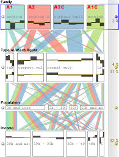
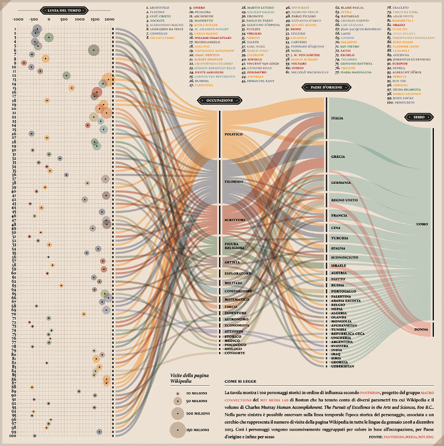
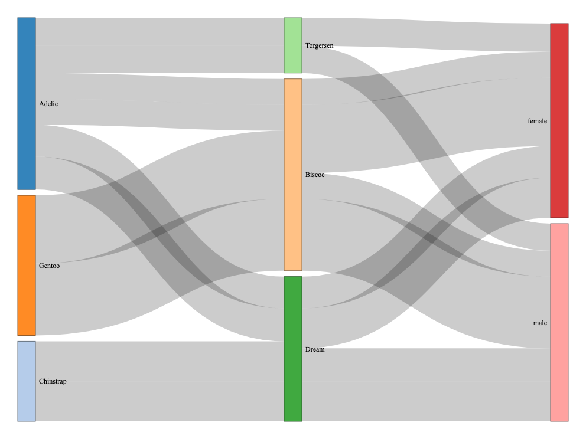
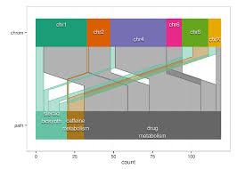
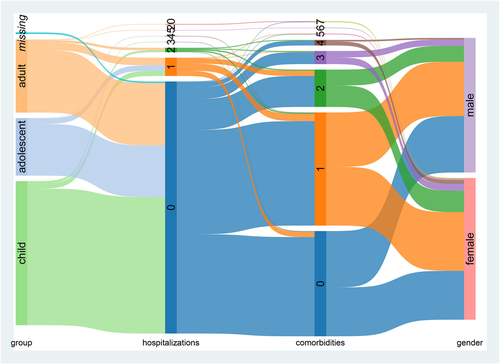

```{r setup, include=FALSE}
knitr::opts_chunk$set(
  echo = FALSE, 
  message = FALSE, 
  warning = FALSE,
  fig.width = 8,
  fig.height = 5,
  dpi = 300
)

# Load required packages
library(GGally)
library(palmerpenguins)
library(tidyverse)
library(gridExtra)
library(ggpcp)
library(datasets)
library(knitr)
library(kableExtra)
library(ggforce)

source(here::here("numerical_tie_attempts/toy_example.R"))


# Set theme
theme_set(theme_bw(base_size = 11))
```

# Introduction and Motivation

Parallel coordinate plots (PCPs) are a powerful technique for investigating patterns across multiple attributes (variables) simultaneously [@inselberg2009].
PCPs assign each dimension of an $n$-dimensional dataset to a vertical axis, with the axes arranged in parallel [@wegman1990]. 
Observations are drawn as polylines connecting a single point along each dimensional axis in sequence, providing a perspective on hard-to-visualize multidimensional data that can be used to identify clusters, outliers, and other facets of a dataset. 


When multiple observations share the same value in a given dimension, their polylines perfectly overlap at that changepoint, creating "visual collisions" that mask information about the joint distribution between variables and obscure the density along a single axis. 
The treatment of ties is an aspect not generally addressed in the original parallel coordinate plots of Inselberg [-@inselberg1985] and Wegman [-@wegman1990]. 

PCPs were canonically used to show continuous random variables, but their generalization to categorical data only exacerbated the problem of ties.
The most straightforward treatment of categorial random variables, which is taken by Categorical PCPs [@pilhöfer2013], is to assign each level a numeric value; this results in ties at any non-unique value for each variable; an example is @fig-categorical-fix(a).
[However, alternate treatments developed separately out of categorical data visualization research, including Parallel Sets [@kosara2006] and Alluvial diagrams, and the conceptually similar Sankey diagrams^[Sankey diagrams do not always have parallel axes, but they are visually similar and frequently use parallel axis constructions.]
Variations on these plots, such as common angle plots [@hofmann2013], address perceptual distortions that arise when line widths are evaluated along the vertical rather than the orthogonal direction, offering an alternative encoding that more faithfully communicates categorical association strengths.
Hammock plots [@schonlau2003], another type of PCP that accommodates categorical and continuous variables, shows multiple bivariate relationships using parallelograms drawn between axes.
Parallel Sets and Hammock plots preserve the marginal and bivariate frequency information, but do not allow reconstruction of the full multivariate density, because individual observations are not shown; because of the ties, CPCPs also do not allow for reconstruction of the full multivariate density, as it is impossible to distinguish a single observation as it passes through a cluster of observations on a categorical axis.

The development of generalized PCPs (via the software implementation `ggpcp` [@vanderplas2023]) represents a major step forward in representing the full joint distribution of the data while showing individual observations. 
One innovation in the `ggpcp` package is its handling of ties on *categorical* axes: each level is allocated a box proportional to its marginal frequency, and the observations sharing that level are spread evenly within the box so that individual lines remain visible.
Sorting methods are implemented to distribute the tied values in a way that reduces the overall complexity of the plot, as random line-crossings can make PCPs difficult to read and interpret.
Ties on an axis that remains *numeric*, however, are not spread: observations sharing a value are plotted at the same point and their lines overlap. This is the gap the present proposal addresses, and we return to it in detail in @sec-numerical.

This project aims to extend the treatment of categorical variables in generalized PCPs by implementing a solution to tie-breaking in continuous variables. 
The solution will have the following properties:

- marginal density information (approximately) faithfully represented on the vertical axis
- individual lines which can be visually distinguished, at least for data where the number of observations does not lead to overplotting
- observations will be sorted hierarchically within the tied treatment in order to minimize extraneous line-crossings that lead to perceptual complexity.

An immediate consequence of the second objective is that the viewer will be able to (at least in theory) reconstruct the full joint distribution between variables from the plot. 
We will extend the method used in `ggpcp` to represent categorical data to continuous variables, modifying it to maintain the approximate scaling of the continuous variable, with slight local distortions when tied values occur.
In addition, we will develop a consistent visual representation to provide visual cues which indicate the presence of a local distortion due to tied values, while preserving the visual representation of singular values on the parallel axis.

Combining the density-preserving advantage of Hammock plots with the individual-observation traceability of generalized PCPs yields a display that carries marginal density on a numerical axis while retaining the full joint distribution and per-observation tracing that motivate GPCPs. 
Real-world data sets frequently have both categorical and numerical data, and duplicated values in either type of variable. 
Our extension of GPCPs will extend the ability to visually represent, examine, and assess these data sets. 

## Related Work {#sec-related-work}

The parallel coordinate plot literature has developed over several independent avenues of investigation in different communities within statistics and computer science.
Here, we review several historical attempts to address overplotting and the treatment of categorical variables.

### Overplotting and density

Early responses to visual overplotting in PCPs used transparency and kernel density estimation rather than positional adjustment. 
Alpha-blending, as used by Miller and Wegman [-@miller1991], allows the density of overlapping lines to become visible through saturation, but sacrifices the ability to trace individual observations. 
More recent approaches include density-based rendering [@heinrich2013] and edge bundling [@mcdonnell2008], both of which trade individual traceability for aggregate clarity.

A distinct family of positional-adjustment methods resolves overplotting by displacing tied or near-tied points along an axis rather than by blending them. 
Jittering adds random offsets [@chambers1983]; beeswarm layouts (`ggbeeswarm`, and the density-outline variant realized in beanplots [@kampstra2008]) replace random noise with a deterministic packing that spreads points to avoid overlap while approximating the marginal density through the width of the resulting cloud. 

These methods differ in what they do with the overlapping value itself, and the distinction matters for the parallel-coordinates setting. 
Jittering perturbs the value: each point is offset by random noise, so a tied observation is no longer plotted at the value it holds, and the displacement carries no information, two points at the same jittered height are not related, and a point's position is not recoverable. 
Beeswarm layouts preserve the value on the measurement axis and displace only orthogonally to it: tied points are packed sideways along the second, non-data axis, so the measured value is read exactly while the width of the resulting cloud becomes an emergent encoding of how many observations share it. 
Beanplots [@kampstra2008] abandon the individual point entirely at high density, replacing the packed cloud with a smoothed density outline, so overlap is resolved by aggregation rather than by displacement, the marginal distribution is read cleanly and the individual observation is no longer addressable. 
The three therefore sit on a spectrum: jitter sacrifices positional fidelity to retain the points, beanplots sacrifice the points to retain the distribution, and beeswarms retain both but only by consuming a free orthogonal dimension.

For categorical overlap the situation is different again, because the notion of a tie is not incidental but constitutive: every observation in a level shares that level's position exactly, so overlap is total rather than occasional and there is no metric spacing to preserve. 
Displays built for categorical axes accordingly resolve overlap by allocating each level a region and distributing observations inside it. 
Parallel Sets [@kosara2006] and alluvial and Sankey diagrams aggregate: the observations sharing a category are merged into a ribbon whose width encodes the frequency, so overlap is resolved by not drawing individual cases at all. 
Hammock plots [@schonlau2003] do the same with constant-width parallelograms, encoding frequency as area and recovering individual cases only through highlighting. 
The generalized PCPs of `ggpcp` [@vanderplas2023] take the opposite route: observations within a level are spread to equal spacing across the level's allocated box, so each case remains an individual polyline and the marginal frequency is read from the box height rather than from a ribbon width. 
This spread is what the present work extends, and the contrast with the numerical methods above is exactly the gap it must close: `ggpcp` resolves categorical overlap by distributing within an allocation, whereas beeswarms resolve numerical overlap by packing orthogonally into free space and a numerical PCP axis has no free orthogonal space to pack into, because the horizontal direction is already spent on the axis sequence itself.

The `tie_spread` construction developed here is closely related to these methods at the level of a single axis, like a beeswarm, it displaces coincident observations within a bounded region so that each becomes individually visible, and we adopt that lineage deliberately. 
The novelty is not the act of spreading points on one axis but three properties that single-axis beeswarm and jitter methods are not designed to provide, and that matter specifically in the parallel-coordinates setting. 
First, the displacement is bounded by and anchored to the global axis resolution $\delta_j$ rather than to the local point density: a beeswarm widens its cloud wherever points are dense, which on a shared axis would let a heavily-tied value bleed into its neighbors and destroy the metric gaps between distinct values, whereas an identical, resolution-anchored allocation at every value preserves those gaps (@sec-math-step3). 
Second, and most importantly, a beeswarm positions points on one axis in isolation, but a point in a PCP is the junction of two polyline segments; the within-band ordering must therefore be chosen to keep those segments coherent across axes. 
The hierarchical sorting of @sec-sorting supplies exactly this cross-axis constraint, tied observations are ordered by their positions on an adjacent axis so that lines leaving the band do not cross inside it, a consideration that has no analog in a stand-alone beeswarm, where there is no neighboring axis to cohere with. 
Third, because the spread is a legibility artifact rather than data, the construction is paired with an explicit visual cue marking the tie region and its extent (@sec-visual-cues), and is unified with the categorical tie-breaking grammar already in `ggpcp` (@sec-unified) so that a single visual convention governs spreading on both axis types. 
In short, `tie_spread` imports the point-separation goal of beeswarm methods into parallel coordinates and adds the resolution anchoring, cross-axis sorting, and grammar-level integration that the multi-axis setting requires.


### Categorical extensions

::: {#fig-historical-1 layout="[[30,-5,30,-5,30],[30,-5,30]]" .historical-grid}
{#fig-parsets}

{#fig-alluvial}

{#fig-sankey}

{#fig-commonangle}

{#fig-hammock}
:::


The categorical parallel axis plot literature developed largely independently of classical PCPs. 
Parallel Sets [@kosara2006] replaced individual polylines with ribbons whose widths encode bivariate frequencies, enabling unambiguous density reading at the cost of individual tracing (@fig-parsets). 
Alluvial diagrams [@brunson2020] and Sankey diagrams adopt a similar ribbon-based representation (@fig-alluvial and @fig-sankey). 
Common angle plots [@hofmann2013] addressed a further perceptual distortion specific to variable-width ribbons: the Müller-Lyer family of line-width illusions causes ribbon widths evaluated along the vertical to appear systematically different from their orthogonal widths. 
By constraining ribbons to a constant angle, common angle plots recover perceptually accurate frequency judgments (@fig-commonangle). 
Hammock plots [@schonlau2003; @schonlau2024] occupy a different position: they accommodate both categorical and continuous variables via constant-width parallelograms, but restrict inference to bivariate relationships between adjacent axes (@fig-hammock).


### Perceptual bounds on vertical displacement

A separate and longstanding thread of the perceptual literature is directly relevant to how much spread the tie-breaking algorithm may safely introduce. 
The sine illusion, formalized by @day1991 and analyzed in statistical graphics by @vanderplas2015, shows that the vertical extent of a line segment is not perceived neutrally: when equal-length segments are arrayed along a curve, those at extrema appear systematically longer than those at intermediate positions. 
This illusion belongs to the Müller–Lyer family that also underwrites the line-width illusion treated by @hofmann2013 in their development of common angle plots. 
It therefore predates, and is independent of, the present tie-breaking method: common angle plots were already engaging with it by 2013 [@hofmann2013], well before the generalized-PCP machinery this proposal builds on.


This illusion provides a specifically perceptual rationale for an upper bound on within-band spread that a purely geometric argument does not. Because the sine illusion inflates the apparent vertical extent of segments arrayed along a curve, a band that occupies too large a fraction of the resolution $\delta_j$ risks having its tie-breaking displacement—an artifact introduced for legibility—misperceived as genuine variation in the data, especially where lines fan steeply out of a heavily tied band. 
This is the perceptual consideration behind keeping $\sigma$ strictly below $1$. Our provisional choice $\sigma = 0.9$ is a conservative default that explicitly reserves the outermost tenth of each band as a safety margin against this effect. 
It complements the "just noticeable difference" lower bound on the inter-band gap developed in @sec-math-step3: together, these arguments bracket a defensible range for $\sigma$ from opposite directions.
What remains open is not whether an upper bound exists, but how tight it must be in practice. 
Whether the sine illusion meaningfully affects within-band displacement for continuous, traceable lines is an empirical question, and there are reasons to expect such lines may largely avoid it. 
Accordingly, @sec-defaults treats the calibration study as a way to refine the numerical value of this upper bound around the conservative default $\sigma = 0.9$, rather than to establish its existence.

### Axis and category ordering

A well-studied property of PCPs is that axis order strongly affects both the number of line crossings and the interpretability of patterns [@vanderplas2023]. 
Minimizing line crossings through reordering is NP-hard in general [@murt2003], but heuristics based on correlation structure and sum of ranking differences provide tractable approximations [@ipkovich2021]. 
Within a fixed axis ordering, the order of factor levels and the plotting order of individual observations interact with tie-breaking: factor levels ordered to minimize crossings produce fewer extraneous crossings for any given tie-resolution strategy.
Rendering order also matters: the `overplot` parameter in `ggpcp` controls which observations are rendered on top when lines overlap [@vanderplas2023]. 
These considerations interact directly with the hierarchical sorting approach from `ggpcp` which has been extended in this proposal.
This approach is discussed further in @sec-sorting.


### Computational quality metrics

Dennig et al. [-@dennig2021] formalized a suite of screen-space quality metrics for Parallel Sets, including ribbon overlap, crossing angle, orthogonality, and ribbon width variance; the suite is collectively named ParSetgnostics. 
These metrics provide an empirical basis for comparing and optimizing parallel axis layouts without requiring user studies, and are candidate measures for the computational benchmarking component of our evaluation plan.

# Categorical Variables and Ties {#sec-categorical-ties}

The `ggpcp` package currently addresses categorical ties through a combination of sorting and tie-breaking algorithms. 
The package implements hierarchical sorting through the `pcp_arrange(data, method, space)` function, which orders observations based on a hierarchical application of variable values. 
The `method` parameter determines the sequence in which variables are considered when resolving ties in the arrangement. 
The `space` parameter specifies the proportion of the y-axis dedicated to empty space between levels of categorical variables (@fig-categorical-fix).

```{r}
#| label: fig-categorical-code
#| echo: true
#| eval: false


# 1. Modular Data Pipeline (The correct Step 1, 2, 3)
# Note: 'pcp_data' is used here as a variable name for the transformed object.
pcp_data <- mtcars %>%
  mutate(across(c(cyl, am, gear, carb), as.factor)) %>%
  pcp_select(cyl, am, gear, carb) %>%     # Step 1: Reshape data
  pcp_scale(method = "uniminmax") %>%     # Step 2: Scale axes
  pcp_arrange(method="from-left")         # Step 3: Break Ties, 
                                          #         sorting from left
```

```{r}
#| label: fig-categorical-fix
#| message: false
#| echo: false
#| fig-subcap: ['Standard PCP, no tie breaking', 'GPCP, tie breaking, no sorting', 'GPCP, categorical ties, sorted from left', 'GPCP, categorical ties, sorted from right']
#| layout-ncol: 2
#| fig-cap: "Comparison of tie-breaking methods for categorical variables in parallel coordinate plots using mtcars data. Standard PCP (top-left) shows overlapping lines without tie-breaking. GPCP with tie-breaking but no sorting (top-right) spreads observations evenly within categories. GPCP with sorting from left (bottom-left) and from right (bottom-right) apply hierarchical sorting to minimize line crossings, with light gray boxes indicating category groupings."

library(ggpcp)
library(ggplot2)
library(dplyr)
library(patchwork)
# 1. Modular Data Pipeline (The correct Step 1, 2, 3)
# Note: 'pcp_data' is used here as a variable name for the transformed object.
pcp_data <- mtcars %>%
  mutate(across(c(cyl, am, gear, carb), as.factor)) %>%
  pcp_select(cyl, am, gear, carb) %>%           # Step 1: Reshape data
  pcp_scale(method = "uniminmax")         # Step 2: Scale axes

p0 <- pcp_data %>%
ggplot(aes_pcp()) +
  geom_pcp(aes(color = cyl), alpha = 0.6) + 
  geom_pcp_boxes(boxwidth = 0.1, fill = "white", alpha = 0.5) +
  geom_pcp_labels() +
  theme_pcp() +
  # labs(title = "Standard PCP", subtitle = "No Tie Breaking") + 
  guides(color="none")


# 2. Plotting with aes_pcp()
# Use aes_pcp() to automatically map the transformed pcp_x, pcp_y, and pcp_id variables.
p2 <- pcp_data %>%
  pcp_arrange("from-left") %>% # Sort from left
  ggplot(aes_pcp()) +
  geom_pcp(aes(color = cyl), alpha = 0.6) + 
  geom_pcp_boxes(boxwidth = 0.1, fill = "white", alpha = 0.5) +
  geom_pcp_labels() +
  theme_pcp() +
  # labs(title = "GPCP: Cat. Ties + Sorting", subtitle = "Sort from left") + 
  guides(color="none")


p3 <- pcp_data %>%
  pcp_arrange("from-right") %>% # Sort from right
  ggplot(aes_pcp()) +
  geom_pcp(aes(color = cyl), alpha = 0.6) + 
  geom_pcp_boxes(boxwidth = 0.1, fill = "white", alpha = 0.5) +
  geom_pcp_labels() +
  theme_pcp() +
  # labs(title = "GPCP: Cat. Ties + Sorting", subtitle = "Sort from right") + 
  guides(color="none")

pcp_data2 <- mtcars %>%
  mutate(across(c( cyl, am, gear, carb), as.factor)) %>%
  pcp_select(cyl, am, gear, carb) %>%
  pcp_scale(method = "uniminmax") %>%     # Step 2: Scale axes
  pcp_arrange("from-right") %>% # Sort from right
  # This shuffles everything within category, ensuring no sorting persists
  group_by(pcp_x, pcp_level) %>%
  mutate(order = permute::shuffle(n()),
         pcp_y = pcp_y[order],
         pcp_yend = pcp_yend[order])

p1 <-  pcp_data2 %>%
  # ungroup() %>%
  # pcp_arrange_opts(method="none", .by_group = F) %>% # No sorting - overwrote pcp_arrange()
  ggplot(aes_pcp()) +
  geom_pcp(aes(color = cyl), alpha = 0.6) + 
  geom_pcp_boxes(boxwidth = 0.1, fill = "white", alpha = 0.5) +
  geom_pcp_labels() +
  theme_pcp() +
  # labs(title = "GPCP: Tie Breaking", subtitle = "No sorting") + 
  guides(color="none")

p0
p1 
p2
p3
```


The ability to follow individual observations is key to being able to reconstruct the full joint distribution across parallel axes. 
`ggpcp` creates equally spaced points within each category that span the portion of the vertical axis dedicated to the category (preserving the marginal frequency information, which is optionally emphasized with `geom_pcp_boxes`). 
@fig-categorical-fix(a) shows a PCP without this categorical tie-breaking approach while @fig-categorical-fix(b) shows a PCP with tie-breaking but without sorting. 
`ggpcp` goes one step further by using hierarchical sorting (from the left, right, or both) to minimize unnecessary line crossings induced by the treatment of tied categorical variables. 
The importance of hierarchical sorting to the overall visual effect of the tie-breaking treatment of categorical variables is emphasized through the contrast between @fig-categorical-fix(b) and @fig-categorical-fix(c) and @fig-categorical-fix(d), which show sorting from the left and right respectively. 
We define a necessary line crossing as an intersection between lines from different observations which is induced by the order of x-axis variables and scaled values, rather than by the treatment of categorical or numerical tie-breaking algorithms. 
Hierarchical sorting minimizes the number of necessary line crossings, minimizing visual clutter.
The hierarchical sorting serves as a form of "external cognition," reducing the cognitive load required to "untangle" and mentally group crossed lines. 

Having addressed categorical ties as implemented in `ggpcp`, it is worthwhile to examine how a viewer would follow a line across a generalized PCP with both numeric and categorical variables to illustrate the additional challenges introduced when numerical ties are present.

::: {layout="[[30,-5,30,-5,30],[30,-5,30]]" .pcp-trace-grid}

{#fig-figure-1 width="90%"}

{#fig-figure-2 width="90%"}

{#fig-figure-3 width="90%"}

{#fig-figure-4 width="90%"}

{#fig-figure-5 width="90%"}

:::

```{=html}
<style>
.pcp-trace-grid figure { margin-right: 1.5em; margin-bottom: 1.2em; }
.pcp-trace-grid figcaption { padding: 0 0.75em; }
</style>
```
```{=latex}
\captionsetup[subfigure]{margin=0.75em}
```

```{r}
#| include: false

# This chunk is just to get the pdf that can be imported into Inkscape for generating the figure sequence...
my_mtcars <- mtcars %>%
  mutate(across(c(cyl, am, gear), as.factor)) %>%
  mutate(am = factor(am, levels = c(1, 0), ordered = T),
         inv_wt = -wt) 
pcp_data <- my_mtcars %>%
  pcp_select(cyl, am, mpg, qsec, inv_wt, gear, drat) %>%          
  pcp_scale(method = "uniminmax") %>%
  pcp_arrange()

p <- pcp_data %>%
  pcp_arrange("from-left") %>% # Sort from left
  ggplot(aes_pcp()) +
  geom_pcp(aes(color = cyl), alpha = 0.6) + 
  geom_pcp_boxes(boxwidth = 0.1, fill = "white", alpha = 0.5) +
  geom_pcp_labels() +
  theme_pcp() + 
  guides(color="none")
ggsave("images/pcp_orig_ggplot2.pdf", p, width=8, height=4, units="in")
```

```{r}
#| include: false
#| eval: false
#| 

# 1. Data Preparation
my_mtcars <- mtcars %>%
  mutate(across(c(cyl, am, gear), as.factor)) %>%
  mutate(am = factor(am, levels = c(1, 0), ordered = TRUE),
         inv_wt = -wt) 

pcp_data <- my_mtcars %>%
  pcp_select(cyl, am, mpg, qsec, inv_wt, gear, drat) %>%          
  pcp_scale(method = "uniminmax") %>%
  pcp_arrange()

# 2. Select exactly 6 rows to highlight
# You can slice(1:6) or select specific indices that show interesting bifurcations
highlight_lines <- pcp_data %>% 
  dplyr::slice(1:3) 

# 3. Create the Plot
pcp_data %>%
  pcp_arrange("from-left") %>% 
  ggplot(aes_pcp()) +
  # Background: All lines, heavily de-emphasized to clear the "wire-heavy" look 
  geom_pcp(aes(color = cyl), alpha = 0.05, size = 0.2) + 
  
  # THE HALO: Thicker white lines to separate the 6 traces from the background 
  geom_pcp(data = highlight_lines, 
           color = "white", 
           alpha = 0.8, 
           size = 2.5, 
           over = 0) +
  
  # THE TRACE: The 6 specific lines 
  # 'over = 0' ensures they don't merge/bundle, showing individual path splits 
  geom_pcp(data = highlight_lines, 
           aes(color = cyl), 
           alpha = 1, 
           size = 1.2, 
           over = 0) +
  
  # Structural elements: Boxes and Labels to anchor numerical ties 
  geom_pcp_boxes(boxwidth = 0.1, fill = "white", color = "gray90", alpha = 0.5) +
  geom_pcp_labels() +
  
  # Formatting
  scale_color_manual(values = c("4" = "#1f78b4", "6" = "#e31a1c", "8" = "#33a02c")) +
  theme_pcp() + 
  guides(color = "none") +
  labs(title = "Six-Path PCP Trace",
       subtitle = "Tracing specific observations to highlight multi-axis bifurcations")


```


- Step 1: Identify the Parallel Axes (@fig-figure-1).    
Begin by identifying each vertical axis in the plot. 
Each axis represents one variable from the dataset. 
The axes are typically arranged from left to right, and the order may be determined by the data analyst to highlight specific relationships or minimize visual clutter.

- Step 2: Locate the Starting Point (@fig-figure-2).    
Find the observation of interest on the leftmost axis. 
The vertical position indicates the scaled value of that observation for the first variable. 
If you are examining a highlighted or color-coded observation, look for its distinctive marker at this starting position.

- Step 3: Follow the Line Segment (@fig-figure-3).    
Trace the line segment from the starting point to its intersection with the next axis. 
The human visual system naturally follows smooth, continuous paths due to the Gestalt principle of good continuation, which allows viewers to perceive connected line segments as a single, piecewise continuous line, making it easier to track observations across multiple parallel axes.

- Step 4: Read Values at Intersections (@fig-figure-4).    
At each axis intersection, the vertical position of the line indicates the observation's value for that variable. Read these values to understand how the observation changes (typically, relative to the other observations) across different dimensions of the data. 
The slope of line segments between axes provides information about the relationship between consecutive variables for that specific observation.

- Step 5: Continue Across All Axes (@fig-figure-5).    
Repeat the tracing process for each consecutive pair of axes until reaching the rightmost axis. 
By following the complete path, you obtain a comprehensive view of how that particular observation behaves across all measured variables. 
The vertical positions along each axis represent scaled values that can be interpreted as quantiles when the data are appropriately transformed. 
This enables identification of unique characteristics, cluster membership, or outlier status.

{#fig-figure-6 width="90%"}

- Step 6: Ties in Numbers — A Fork in the Road (@fig-figure-6).

What was once a single point now becomes the starting point for two separate line segments that go in different directions. 
The Gestalt principle of good continuation doesn't work anymore when two or more lines come from the same point on an axis. 
In this configuration, color is the only channel that can provide separate line identity across the tie and even then, only when the palette is carefully chosen. 
The cyan/red separation failure in @fig-figure-6 also raises an accessibility concern that any color-dependent identity encoding inherits: hue distinctions that are marginal for typical trichromatic viewers can vanish entirely under the common forms of color-vision deficiency (deuteranopia and protanopia together affect roughly 8% of men), so a display whose tracing depends on hue alone excludes a non-trivial share of readers. 
Two design consequences follow for this work. 
First, all figures in this proposal use color-blind-safe palettes — the Okabe–Ito qualitative palette for discrete observation identities and the perceptually-uniform viridis family for continuous mappings — chosen so that adjacent lines remain separable under simulated dichromacy. 
Second, and more fundamentally, the tie-breaking algorithm is designed so that color is *not* load-bearing: positional separation within the band, the monotone cross-axis ordering, and the explicit tie-region cue (@sec-visual-cues) each carry observation identity through channels — position and enclosure — that are robust to color-vision deficiency, with hue retained as a redundant rather than sole encoding. 
The visual continuity that made tracing easy in earlier steps breaks down exactly where it is needed most. 
The observer cannot tell if the original observation follows the upper branch or the lower branch of the fork unless there are more visual cues, like color coding, clear labels, or a systematic tie-breaking arrangement. 
This lack of clarity is not just an aesthetic problem; it also makes it harder for the user to identify patterns that would be difficult to see in tabular data by following individual observations through high-dimensional space.
This ability to trace individual observations is one of the central reasons the improvements to PCPs in `ggpcp` are so effective.


```{r}
#| label: fig-working-theory
#| echo: false
#| fig-width: 9
#| fig-height: 4
#| fig-cap: "Comparison of a standard PCP with overlapping ties (left) and the proposed
#|   tie-breaking algorithm with `from-left` hierarchical sorting (right). Tied
#|   observations on Year B are spread within a resolution-based interval (blue boxes)
#|   and ordered by their Year A values, eliminating within-band crossings. A visible
#|   gap is preserved between the tie bands for 2000 and 2001: separation between bands
#|   is essential for the Gestalt grouping argument to hold, since adjacent bands that
#|   touch would visually merge and the reader would lose the ability to distinguish
#|   distinct values. The band width is therefore set strictly below the global axis
#|   resolution $\\delta_j$. Remaining crossings are necessary crossings induced by
#|   the data structure rather than artifacts of tie-breaking."

library(ggplot2)
library(dplyr)
library(patchwork)

# ── 1. Raw data ───────────────────────────────────────────────────────────────
raw <- tibble(
  id    = 1:18,
  yearA = c(1990, 1991, 1993, 1995, 1996, 1997,
            1998, 1999, 2000, 2001, 2002, 2003,
            2003, 2004, 2004, 2005, 2006, 2007),
  yearB = c(1980, 1980, 1980, 1980, 1980, 1980,
            2000, 2000, 2000, 2000, 2000, 2000,
            2001, 2001, 2001, 2001, 2001, 2001),
  value = c(15,   40,   60,   25,   80,   50,
            35,   70,   20,   90,   45,   65,
            30,   55,   85,   10,   75,   95)
)

# ── 2. Scale to [0, 1] ────────────────────────────────────────────────────────
s01 <- function(x) (x - min(x)) / (max(x) - min(x))
dat <- raw %>% mutate(sA = s01(yearA), sB = s01(yearB), sV = s01(value))

# ── 3. Axis resolution & spread width ────────────────────────────────────────
# A visible gap between adjacent tie bands is essential for the Gestalt argument:
# bands that touch at the 2000/2001 boundary would visually merge, collapsing the
# very separation the reader is meant to perceive. We therefore take the band
# width as a fraction of the global axis resolution, leaving the remainder as gap.
uB         <- sort(unique(dat$sB))     # scaled positions: 1980, 2000, 2001
delta      <- min(diff(uB))            # smallest gap between distinct values (2000–2001)
band_frac  <- 0.55                     # band occupies 55% of delta; 45% remains as gap
spread     <- delta * band_frac

# ── 4. From-left tie-breaking on Year B ───────────────────────────────────────
dat_broken <- dat %>%
  group_by(sB) %>%
  arrange(sA, .by_group = TRUE) %>%
  mutate(
    n    = n(),
    rank = row_number(),
    lo   = pmax(0,  sB - spread / 2),
    hi   = pmin(1,  sB + spread / 2),
    sBk  = if_else(n == 1L, sB, lo + (rank - 1L) / (n - 1L) * (hi - lo))
  ) %>%
  ungroup()

# ── 5. Long format ────────────────────────────────────────────────────────────
to_long <- function(d, broken = FALSE) {
  yB <- if (broken) d$sBk else d$sB
  bind_rows(
    tibble(id = d$id, x = 1, y = d$sA),
    tibble(id = d$id, x = 2, y = yB),
    tibble(id = d$id, x = 3, y = d$sV)
  )
}
long_before <- to_long(dat,        broken = FALSE)
long_after  <- to_long(dat_broken, broken = TRUE)

# ── 6. Colours (colour-blind safe) ───────────────────────────────────────────
obs_cols <- c(
  "1" = "#E69F00", "2" = "#56B4E9", "3" = "#009E73",
  "4" = "#CC79A7", "5" = "#0072B2", "6" = "#D55E00"
)

# ── 7. Year B reference: breaks and labels for the secondary axis ─────────────
yB_breaks <- uB
yB_labels <- c("1980", "2000", "2001")

# ── 8. Tie boxes (after panel only; singleton at 2001 receives no box) ────────
tie_boxes <- dat_broken %>%
  group_by(sB) %>%
  filter(n() > 1) %>%
  summarise(lo = first(lo), hi = first(hi), .groups = "drop") %>%
  transmute(xmin = 1.87, xmax = 2.13, ymin = lo, ymax = hi)

# ── 9. Shared theme ───────────────────────────────────────────────────────────
pcp_theme <- theme_bw(base_size = 10) +
  theme(
    panel.grid         = element_blank(),
    axis.text.y.left   = element_blank(),
    axis.ticks.y.left  = element_blank(),
    axis.title         = element_blank(),
    plot.title         = element_text(size = 10, face = "bold", hjust = 0.5),
    # Secondary axis: Year B reference labels, rendered in the right margin
    axis.text.y.right  = element_text(size = 7.5, colour = "grey35"),
    axis.ticks.y.right = element_line(colour = "grey50", linewidth = 0.3),
    axis.title.y.right = element_text(size = 8, colour = "grey40",
                                       angle = 270, vjust = 0.5)
  )

# ── 10. Plot factory ──────────────────────────────────────────────────────────
make_pcp <- function(long, title, boxes = NULL) {

  p <- ggplot(long, aes(x, y, group = id, colour = factor(id))) +
    # Tie boxes drawn first so lines render on top
    geom_vline(xintercept = c(1, 2, 3), colour = "black", linewidth = 0.5) +
    geom_line(linewidth = 0.8, lineend = "round") +
    scale_colour_manual(values = obs_cols, guide = "none") +
    scale_x_continuous(
      breaks = 1:3,
      labels = c("Year A", "Year B", "Value"),
      limits = c(0.55, 3.45),
      expand = c(0, 0)
    ) +
    # Primary y-axis: unlabelled (PCP convention)
    # Secondary y-axis: Year B reference — rendered in the margin, never overlaps lines
    scale_y_continuous(
      limits   = c(-0.05, 1.05),
      expand   = c(0, 0),
      breaks   = NULL,
      sec.axis = sec_axis(
        transform = ~ .,
        breaks    = yB_breaks,
        labels    = yB_labels,
        name      = "Year B"
      )
    ) +
    # Small tick marks on the Year B axis itself for visual anchoring
    annotate("segment",
             x = 1.97, xend = 2.03,
             y = yB_breaks, yend = yB_breaks,
             colour = "grey40", linewidth = 0.45) +
    labs(title = title) +
    pcp_theme

  if (!is.null(boxes)) {
    p <- p + geom_rect(
      data      = boxes,
      aes(xmin = xmin, xmax = xmax, ymin = ymin, ymax = ymax),
      inherit.aes = FALSE,
      fill      = "#AED6F1",
      colour    = "#2471A3",
      alpha     = 0.35,
      linewidth = 0.5
    )
  }

  p
}

p_before <- make_pcp(long_before, "Before: Exact Values")
p_after  <- make_pcp(long_after,  "After: From-Left Sorting", tie_boxes)

p_before + p_after
```

```{r}
#| label: fig-beeswarm-vs-tiespread
#| echo: false
#| message: false
#| warning: false
#| eval: false
#| fig-width: 9
#| fig-height: 4.5
#| fig-cap: "Single-axis beeswarm spreading (left) versus the `tie_spread` extension
#|   (right) on the same 40-observation dataset. Year B carries heavy ties: 16 cases at
#|   1998, 16 at 2000, and 8 at 1980. Because 1998 and 2000 are close on the axis, the
#|   beeswarm's *density-driven* packing widens each cloud until the two encroach on one
#|   another — the horizontal spread is governed by how many points must be packed, not by
#|   the axis scale, and there is no neighboring axis for the within-value order to cohere
#|   with. The `tie_spread` panel anchors every band to a fixed fraction of the axis
#|   resolution $\\delta_j$ (blue boxes, identical height regardless of count) so heavily-tied
#|   values stay separated, and orders each band by the Year A neighbour so polylines leave
#|   Year B without avoidable crossings. The beeswarm shows *what* single-axis separation
#|   achieves; the right panel shows the resolution anchoring and cross-axis sorting the
#|   multi-axis setting additionally requires."

library(ggplot2)
library(dplyr)
library(patchwork)
library(ggbeeswarm)

# ── 1. Higher-multiplicity toy data (shared by both panels) ───────────────────
set.seed(42)
raw2 <- tibble(
  id    = 1:40,
  # Year B: heavy ties, with 1998 and 2000 placed CLOSE so swarm bleed is visible
  yearB = c(rep(1980,  8),
            rep(1998, 16),
            rep(2000, 16)),
  # Year A and Value: spread out so each tied case has a distinct neighbour position
  yearA = c(sample(1970:1985,  8),
            sample(1986:2001, 16),
            sample(1988:2003, 16)),
  value = c(runif( 8, 0, 100),
            runif(16, 0, 100),
            runif(16, 0, 100))
)

s01 <- function(x) (x - min(x)) / (max(x) - min(x))
dat2 <- raw2 %>% mutate(sA = s01(yearA), sB = s01(yearB), sV = s01(value))

# ── 2. Resolution & band width (same rule as fig-working-theory) ──────────────
uB2        <- sort(unique(dat2$sB))
delta2     <- min(diff(uB2))          # smallest gap: 1998–2000
band_frac  <- 0.55
spread2    <- delta2 * band_frac

# ── 3. from-left tie-breaking on Year B ───────────────────────────────────────
dat_broken2 <- dat2 %>%
  group_by(sB) %>%
  arrange(sA, .by_group = TRUE) %>%
  mutate(
    n    = n(),
    rank = row_number(),
    lo   = pmax(0, sB - spread2 / 2),
    hi   = pmin(1, sB + spread2 / 2),
    sBk  = if_else(n == 1L, sB, lo + (rank - 1L) / (n - 1L) * (hi - lo))
  ) %>%
  ungroup()

long_after2 <- bind_rows(
  tibble(id = dat_broken2$id, x = 1, y = dat_broken2$sA),
  tibble(id = dat_broken2$id, x = 2, y = dat_broken2$sBk),
  tibble(id = dat_broken2$id, x = 3, y = dat_broken2$sV)
)

# ── 4. Panel 1: beeswarm (density-packed, bleeds at 1998/2000) ─────────────────
p_bee <- ggplot(dat2, aes(x = factor(yearB), y = sA, colour = sA)) +
  geom_beeswarm(size = 2.4, cex = 2.2, method = "swarm") +
  scale_colour_viridis_c(guide = "none") +
  labs(x = "Year B", y = "Year A (scaled)",
       subtitle = "ggbeeswarm: single axis, density-packed") +
  theme_bw(base_size = 10) +
  theme(panel.grid.minor = element_blank(),
        plot.subtitle = element_text(face = "bold"))

# ── 5. Panel 2: tie_spread PCP ────────────────────────────────────────────────
tie_boxes2 <- dat_broken2 %>%
  group_by(sA) %>%
  filter(n() > 1) %>%
  summarise(lo = first(lo), hi = first(hi), .groups = "drop") %>%
  transmute(xmin = 1.9, xmax = 2.1, ymin = lo, ymax = hi)

p_pcp <- ggplot(long_after2, aes(x, y, group = id)) +
  geom_rect(data = tie_boxes2,
            aes(xmin = xmin, xmax = xmax, ymin = ymin, ymax = ymax),
            inherit.aes = FALSE,
            fill = "#AED6F1", colour = "#2471A3", alpha = 0.35, linewidth = 0.5) +
  geom_line(aes(colour = sA), linewidth = 0.5, alpha = 0.9, show.legend = FALSE) +
  scale_colour_viridis_c() +
  scale_x_continuous(breaks = 1:3, labels = c("Year A", "Year B", "Value")) +
  labs(x = NULL, y = "scaled value",
       subtitle = "tie_spread: resolution-anchored + cross-axis sorted") +
  theme_bw(base_size = 10) +
  theme(panel.grid.minor = element_blank(),
        plot.subtitle = element_text(face = "bold"))

p_bee + p_pcp + plot_layout(widths = c(1, 1.4))
```


Two implementation details in @fig-working-theory deserve explicit comment because both are load-bearing for the Gestalt argument that motivates the development of a similar tie-breaking approach for numerical axes.
First, each tie band must be narrower than the gap to its nearest neighbor: if the band around $v = 2000$ extended up to meet the band around $v = 2001$, the two values would visually fuse, defeating the separation the spread was meant to make visible. 
The band width in the figure is therefore set to a fraction of the variable resolution $\delta_j$, leaving a deliberate gap between adjacent bands. 
Second, the reader must be able to *see* that gap, not merely have it exist in the coordinate system. 
This is a Gestalt-of-proximity requirement: the gap must lie above the just-noticeable-difference (JND) threshold and so cannot be shrunk to an infinitesimally small size. 
If ties at adjacent values are rendered without a perceptible gap, the grouping cue that "observations within a band share a value" competes with the unintended cue that "bands adjacent to one another belong to the same group." 
The mathematical formalization of this separation requirement appears in Step 3 of the algorithm (@sec-math-step3).
In practice, this restriction will be handled primarily through a warning printed by the software whenever the resolution becomes too small.


The `ggpcp` package implements a tie-breaking algorithm for categorical variables that maintains individual observation traceability by spacing observations evenly within each categorical level:

> "All observations are spaced out evenly. This results in a natural visualization of the marginal frequencies along each axis (additionally enhanced by the light gray boxes grouping observations in the same category) that is not as prominent in the previous three panels. The ordering of the observations within the level is such that a minimal number of line crossings occurs between the axes." (p. 11)

This even spacing within an axis category allows the box height to function as a representation of the marginal proportion of the category relative to the whole.
The sorting is hierarchical not as a stylistic choice but out of necessity: the levels must be processed in order for the arrangement to reduce line crossings across the plot as a whole.
Without hierarchical sorting from the axis out to neighboring axes, lines departing toward different positions on the neighboring axis could cross inside the band.

This hierarchical sorting approach is the subject of @sec-sorting; the spacing formula used for categorical levels is

$$d_i = \frac{S_i - S_i^- - S_i^+}{n_i - 1},$$

where:

-   $S_i$ is the total space allocated to category $i$
-   $S_i^-$ is the spacing below category $i$
-   $S_i^+$ is the spacing above category $i$
-   $n_i$ is the number of observations in category $i$
-   $d_i$ is the optimal spacing distance between consecutive observations.

![Spacing parameters for a categorical axis. Each level $i$ is allocated total height $S_i$, with margins $S_i^+$ above and $S_i^-$ below reserved for inter-level separation. The remaining vertical extent is divided into $n_i - 1$ intervals to seat $n_i$ observations at uniform spacing $d_i$. The parameter-key panel on the right indicates how each quantity is determined: $S_i$ is set by the level's frequency proportion under a user-chosen total budget, $S_i^\pm$ are user-controlled via the `space` argument, $n_i$ is the level frequency, and $d_i$ is derived from the formula at the bottom. The numerical analog of this figure (@fig-figure-7) shares the same layout, color encoding, and formula structure; the differences are confined to how each parameter is set.](images/pcp_line_tracing_guide_images/spacing_categorical.png){#fig-spacing width="90%"}

The spacing formula above is the categorical workhorse: each level $i$ is allocated total height $S_i$, lower and upper margins $S_i^-$ and $S_i^+$ are subtracted to enforce inter-level separation, and the remaining vertical extent is divided into $n_i - 1$ intervals to seat $n_i$ observations.
The proposed numerical framework adopts the same five quantities and the same formula structure, redefining only what determines each parameter; the full mapping is given in @sec-unified (@tbl-unified).
@fig-figure-7 displays the numerical version using the same parameter-key conventions as @fig-spacing, so the two figures can be laid side by side and read as a single procedure with type-specific instantiations rather than as two separate algorithms that happen to share an idea.


A key visual difference emerges when connecting categorical to numerical variables.
As @schonlau2024 observe in their comparison of the two displays, when many observations share a value on a categorical variable and on the adjacent numerical variable, the region spanning the two axes takes on a triangular shape, and the concentration of cases flowing from a single category into a small set of adjacent values reads far more readily in a hammock plot than in a GPCP.

Whether the transition takes a triangular or rectangular form is perhaps less important than what it communicates about the data itself. 
The more interesting question is whether the visualization preserves density information while still allowing viewers to follow individual observations. 
When observations flow from a categorical box toward numerical values, tie-breaking on the numerical axis shapes how clearly we can perceive the underlying distribution.

The `ggpcp` tie-breaking parameters, `method` and `space`, act on variables that are handled as categorical levels.
To obtain any spreading on a *numeric* variable in the current package, a user must first coerce it to a factor.
Doing so does spread the tied observations, but at a price: the metric scale is replaced by equally-spaced levels, so axis position no longer reflects magnitude or the gaps between distinct values, and box height comes to encode frequency, so a heavily-tied value occupies more vertical space than a rarer value at a nearby magnitude.
This represents a different set of trade-offs than hammock plots, which use constant-width parallelograms to show marginal densities directly while individual tracing requires highlighting.
The proposed extension instead keeps the variable numeric: individual observation lines stay intact and density is conveyed by dot density within a resolution-anchored band, so the plot supports both seeing the forest and examining particular trees.
We make this contrast precise in @sec-novelty.

The preceding review of categorical tie-breaking, together with the related work in @sec-related-work, sets the stage for a formal specification of the approach to numerical ties in this proposal detailed in @sec-rq.


# Approach {#sec-rq}

This section states the proposal proper: the research questions the dissertation addresses, the contributions it claims, the plan for implementation and defaults, and the design of the evaluation.
The technical development that these questions build on — the `tie_spread` algorithm, its mathematical specification, the visual-cue design, and preliminary visual results — is presented in @sec-numerical.
@sec-numerical should therefore be read as the developed method and prototype on which the proposal rests; the subsections below set out what remains to be built, defaulted, and empirically tested.

## Research Questions and Contributions {#sec-questions}

The dissertation is organized around three research questions.

*RQ1 (representation).* Can tied observations on a numerical axis be spread so that, simultaneously, (a) the metric ordering and approximate spacing between distinct values are preserved, (b) the marginal density at each value remains recoverable, and (c) individual observations remain traceable across the plot? 
@sec-numerical develops a resolution-anchored construction intended to satisfy all three; the open work is to verify (b) and (c) empirically rather than only by construction.

*RQ2 (defaults).* What default value of the separation parameter $\sigma$, and what default visual-cue design, produce the best trade-off between the legibility of individual lines and the faithful perception of density and of the gaps between adjacent values? 
The provisional default $\sigma = 0.9$ is not yet empirically justified, and the perceptual bounds that would justify it (the just-noticeable-difference lower bound on the inter-band gap and any sine-illusion upper bound on within-band spread, @sec-related-work) are open.

*RQ3 (comparative value).* Does numerical tie-breaking in GPCPs improve users' frequency and comparison judgments relative to (i) GPCPs without it and (ii) hammock plots, the closest mixed-type competitor, and does it do so without sacrificing the individual-tracing advantage that motivates GPCPs?

The proposed contributions are correspondingly: (1) the `tie_spread` algorithm and its formal unification with the categorical tie-breaking already in `ggpcp` (@sec-unified); (2) a tidyselect-grammar implementation that lets users apply spreading per-axis while preserving exact positioning on others; (3) a visual-cue grammar, the numerical analog of `geom_pcp_boxes` and `geom_pcp_labels`, shared across categorical and numerical axes; (4) empirically grounded defaults for $\sigma$ and the cue design; and (5) a controlled evaluation against hammock plots and un-broken GPCPs.

## Implementation and Sensible Defaults {#sec-defaults}

The grammar of graphics is built on the idea of smart defaults that can be customized when necessary.
In `ggpcp`, categorical tie-breaking is supported by `geom_pcp_boxes` and `geom_pcp_labels`, which supply sensible visual cues for categorical levels.
Two parameters require principled defaults for the numerical case: the separation parameter $\sigma$, which governs how much of each resolution band is used for spreading versus reserved as an inter-band gap; and the visual-cue rendering, including whether tie boxes are drawn, whether they are labeled with the original value, and whether boxes are suppressed below a tie-count threshold to reduce clutter.

The provisional default $\sigma = 0.9$ reserves $10\%$ of the resolution band as a gap.
It is provisional precisely because the two perceptual bounds that bracket a defensible value are not yet established: the gap must remain above the just-noticeable-difference threshold so that adjacent bands are not read as a single value (@sec-math-step3), while the spread should remain small enough that within-band displacement is not misread as genuine variance.
We will fix $\sigma$ with a calibration study (described with the main evaluation in @sec-evaluation) that varies $\sigma$ over a grid at several axis resolutions $\delta_j$ and tie multiplicities $k$, and selects the largest $\sigma$ — the most spread, and therefore the best individual legibility — that keeps band-separation errors below a pre-set threshold.

Implementation will proceed in three phases.
Phase 1 builds the core `tie_spread` algorithm and the per-axis tidyselect interface, and resolves whether the tie-box geom is best implemented as a standalone layer or as a `ggproto` extension inheriting from the existing categorical box geom (@sec-visual-cues).
Phase 2 adds the numerical visual-cue geoms and the warning emitted when the resolution becomes too small for a perceptible gap.
Phase 3 fits the defaults from the calibration study and documents them.

## Evaluation: Comparison With Hammock Plots {#sec-evaluation}

Hammock plots [@schonlau2003; @schonlau2024] are the natural comparator: they are the closest mixed categorical/numerical parallel-axis method that foregrounds marginal density, and they make the opposite trade-off to GPCPs, encoding aggregate density through constant-width boxes while supporting individual tracing only through highlighting.
Comparing GPCPs *with* numerical tie-breaking against GPCPs *without* it and against hammock plots isolates the contribution of the proposed method.

**Tasks.** 
We adopt four task types drawn from the elementary graphical-perception tasks used in the visualization literature: (1) *magnitude estimation*, how many observations take a given value on an axis; (2) *ordinal comparison*, which of two values, or which of two bands, holds more cases; (3) *ratio / proportion*, what fraction of the cases in a category flow to a given adjacent value; and (4) *tracing*, whether a highlighted observation takes the upper or lower value at the next axis, which probes the traceability claim directly.

**Hypotheses.** 
*H1:*  On the density tasks (1–3), GPCP-with-tie-breaking is not worse than the hammock plot and both are better than GPCP-without. This follows from the fact that both GPCP-with-tie-breaking and hammocks explicitly resolve converging ties into monotone strands, which should support comparable discrimination of local density structure, whereas GPCP-without leaves high-multiplicity ties visually collapsed. 
That is, once ties are separated into distinct strands, we expect residual differences in accuracy to be driven more by incidental layout and interaction details than by fundamental differences in representational power.

*H2:* On the tracing task (4), GPCP-with-tie-breaking outperforms the hammock plot, since hammock tracing requires highlighting whereas the GPCP preserves continuous lines. 
Theoretically, continuous polylines should reduce the need for visual memory and attentional shifts across fragmented segments, especially when following multi-step paths. 
We therefore treat any residual gap between the two as arising from implementation-specific affordances (e.g., hover highlighting quality) rather than from a deeper limitation of the GPCP representation.

*H3:* The advantage of tie-breaking on density tasks grows with tie multiplicity and is largest for integer-valued variables, where the converging-fan problem is most severe. 
In such settings, collapsing many distinct records into a single visual junction discards fine-grained density information that is partly recovered when ties are split into ordered strands. 
We do, however, view this as a lower bound argument: our predictions are conditional on viewers being able to perceptually resolve the additional strands without overwhelming crowding, so extremely high multiplicities may reintroduce limits that our study cannot fully characterize.

We state H1 with a deliberate caveat, because the two displays do not encode density through the same perceptual channel and the comparison is therefore not a priori symmetric. 
Hammock plots encode marginal frequency as the *area* (equivalently, the width) of a constant-angle parallelogram: position/length-adjacent judgments that rank high in the Cleveland–McGill ordering of elementary perceptual tasks and that the visual system estimates efficiently even at high magnitudes. 
The proposed method instead encodes frequency as *dot density within a fixed-height band*, which reduces either to counting when observations are sparse or to a numerosity/area-of-coverage judgment when they are dense; both are known to be less accurate than length comparison, and the dot-density channel is expected to degrade specifically as within-band density rises and individual dots begin to overplot. 
H1 therefore does *not* predict blanket parity: it predicts parity within the regime the method targets — resolvable tie multiplicities, where dots remain individually legible — and we expect the hammock plot's area encoding to retain an advantage on pure magnitude estimation once density is high enough that the band saturates. 
This crossover is itself of interest and is the reason tie multiplicity is a manipulated factor (H3) rather than a nuisance variable: characterizing the density regime over which dot-density encoding remains competitive with area encoding is one of the empirical contributions of the evaluation, and a failure to find parity even at low multiplicity would be evidence against the representational claim in RQ1.

**Design.** 
The study is within-subjects on plot type (three levels: hammock, GPCP-without, GPCP-with) crossed with task type. Stimuli are generated from controlled synthetic datasets that vary tie multiplicity, axis resolution $\delta_j$, and the number of axes, supplemented by at least one real, integer-heavy dataset (for example the count variables in the penguins or Tour de France data) for ecological validity. 
Trial-level accuracy and response time are the outcomes, analyzed with mixed-effects models carrying random effects for participant and for stimulus. 
Presentation order is counterbalanced and attention checks are included. 
We will run a pilot to estimate response variance, fix the sample size to detect a medium effect at conventional power, and pre-register the design and analysis before data collection.

**Computational benchmarking.** 
Independently of the user study, we will compare layouts using the screen-space quality metrics of @dennig2021. 
Not all transfer: crossing count and crossing angle apply directly to individual-line GPCPs, whereas ribbon-overlap and ribbon-width-variance are defined for ribbon plots and have no direct analog. 
We therefore substitute line-level measures, overplot/line-overlap density and within-band crossing count, and use the latter to confirm computationally that hierarchical sorting removes within-band crossings as @sec-sorting claims, without requiring human subjects. 
This extends the qualitative box-shape comparison of @schonlau2024 to a controlled perceptual experiment in which the tie-breaking extension is a distinct, manipulable condition.

# Numerical Variables and Ties {#sec-numerical}

Currently, numerical variables disrupt some of the best innovations in the GPCP approach by making it impossible to track an observation across the plot and by obscuring marginal density information through overplotting. 
The remaining two chapters of the dissertation will address the handling of ties on numerical axes and assess the utility of visual cues that can be paired with the tie breaking method to indicate that values are approximately accurate spatially and equivalent numerically.

The `ggpcp` package does not currently provide a mechanism for spreading tied values on a variable that remains numeric.
We propose `tie_spread`, an algorithm that distributes observations with identical values along the vertical axis, transforming overlapping lines into a visually resolvable spread. 
Consistent with tidyverse conventions and the tidyselect grammar, the implementation allows users to specify tie-breaking behavior selectively across axes—applying spreading to some variables while preserving exact positioning on others. 
The following sections detail the design and implementation of this approach.

## Relationship to Existing `ggpcp` Tie-Breaking {#sec-novelty}

Because this proposal extends `ggpcp`, it is important to state precisely what `tie_spread` adds to behavior the package already has, since the two are easily conflated.
The existing tie-breaking routine, `pcp_arrange`, is defined for variables that are handled as categorical levels: it allocates each level a box whose height is proportional to the level's marginal frequency and spreads the observations evenly within that box, then orders them by hierarchical sorting (@sec-categorical-ties).
A variable that is kept on a continuous scale receives no such treatment; it is plotted at its exact scaled value, so tied numeric observations coincide at a single point and their lines overlap (@fig-figure-6).

There is an apparent workaround, and naming why it is inadequate is what makes the contribution precise.
A numeric variable can be coerced to a factor, which triggers the categorical spreading above.
This fails the numeric case on two counts.
First, it discards the metric scale: distinct numeric values become equally-spaced factor levels, so vertical position no longer encodes magnitude and the gaps between values — the very information a numeric axis exists to convey — are lost.
Second, it makes box height encode frequency, so a value shared by many observations occupies more vertical space than a rarer value at a nearby magnitude, distorting the axis still further.

`tie_spread` changes exactly the part that fails.
It spreads ties on a variable that stays numeric, anchoring every band to the global axis resolution $\delta_j$ so that band height is constant across values and the metric spacing of distinct values is preserved, and it encodes marginal density through dot density within the band rather than through band height.
The hierarchical sorting that minimizes within-band crossings is inherited unchanged from the categorical machinery; what is new is the allocation and its semantics.
The unified specification in @sec-unified (@tbl-unified) makes this exact: the spacing formula is identical in both cases, and only the right-hand column — how the per-value allocation $S(v)$ and the margins $S^\pm(v)$ are determined — differs from the categorical procedure.

## The Problem: Overlapping Lines

When multiple observations share the same value on a numerical axis, their polylines converge to a single point, and the two failures noted in the introduction recur in their most acute form: individual traceability is lost, and marginal density is obscured (@fig-figure-6). 
The problem is especially severe for integer-valued or coarsely-measured variables, where ties are structurally common rather than incidental.

The `tie_spread` algorithm resolves this by distributing tied observations within a vertical allocation anchored to the axis resolution $\delta_j$ — the smallest distance between any two distinct values on the axis — rather than within a frequency-proportional band. 
Equal margins are reserved above and below so that a gap is preserved between adjacent tied-value bands and the tied observations are spread evenly across the interior of the corresponding band. 
@fig-figure-7 gives the parameters; the formal construction is set out in @sec-math-step3, and its correspondence to the categorical algorithm already in `ggpcp` is discussed in @sec-unified. 
The consequential design choice is what the allocation encodes: marginal density on a numerical axis is carried by the *dot density within each band* rather than by the *vertical extent of each band*. 
This preserves the natural numerical ordering on the axis and avoids the perceptual distortion that variable-height bands at fixed numerical positions would introduce.

![Spacing parameters for a numerical axis, displayed in the same layout as @fig-spacing so the two frameworks read as a single procedure with type-specific instantiations. Each unique value $v$ receives a vertical allocation of height $S(v) = \delta_j$, with margins $S^+(v)$ above and $S^-(v)$ below — both fixed at $(1 - \sigma) \cdot \delta_j / 2$ — that preserve the inter-band gap. The remaining inner region of height $\sigma \cdot \delta_j$ is divided into $n(v) - 1$ intervals to seat $n(v)$ tied observations at uniform spacing $\Delta(v)$. The mapping to @fig-spacing is direct: $S_i \leftrightarrow S(v)$, $S_i^\pm \leftrightarrow S^\pm(v)$, $n_i \leftrightarrow n(v)$, $d_i \leftrightarrow \Delta(v)$, and the spacing formula at the bottom is structurally identical. The innovation, visible in the parameter-key annotations, is in how each quantity is determined: $S(v)$ is anchored to the global axis resolution rather than to frequency, and $S^\pm(v)$ are derived from the separation parameter $\sigma$ rather than user-controlled by default.](images/pcp_line_tracing_guide_images/spacing_numerical.png){#fig-figure-7 width="90%"}


@fig-numerical-in-context shows the parameter spec of @fig-figure-7 applied to a small parallel coordinate plot. Variable B carries three tied groups at $v \in \{0.8, 0.5, 0.2\}$, with $n(v) = 5, 3, 2$ observations respectively. 
All three bands have the same vertical allocation $S(v) = \delta_j$, regardless of $n$, the algorithm encodes marginal density through dot density within the band, not through band height. 
The figure illustrates `from-right` processing, the complement of the `from-left` mode used in @fig-working-theory, so that observations within each band are placed in the order determined by their values on Variable C, the right neighbor. 
The polylines emerging from the band onto Variable C therefore carry no avoidable crossings; the within-band rank is the visible signature of the hierarchical sorting introduced in @sec-sorting. 
Together the two figures illustrate that the algorithm is symmetric: the same construction applies under either processing direction, with the role of the reference axis swapped.
The symmetry is worth stating because it is what makes a single implementation suffice for both `from-left` and `from-right`: `from-both` reuses the identical per-band construction and differs only in the sequence in which axes are visited and in which neighbor each axis references.
Under `from-both`, processing begins at a designated center axis and proceeds outward in both directions, and the reference neighbor for each axis is always the one *nearer the center* — i.e. the neighbor already processed on the current sweep — so that every axis except the center is sorted against a fixed, previously-resolved neighbor exactly as in the one-directional modes. 
The center axis is the sole seam: it has no already-processed neighbor to reference and so is resolved first, before either sweep begins. 
The default is to spread its ties without a sorting reference (equivalently, in input order), which introduces no within-band crossings on the center axis itself (Step 5 still applies within each band) but leaves the between-axis crossings on *both* sides of the center to be minimized by the outward sweeps; an alternative, exposed as an option, seeds the center from whichever single neighbor the user nominates. 
There is no discontinuity to reconcile where the two directions meet, because they do not both write to the same axis: each axis is processed exactly once, by exactly one sweep, and the center is processed exactly once before both. 
What `from-both` cannot claim is *joint* optimality across the seam — because the center is fixed before its neighbors are known, a crossing that a globally-optimal layout would remove by coordinating the two sides simultaneously may remain. This is the same local-heuristic limitation the one-directional modes have, discussed next in @sec-sorting.


![The algorithm of @fig-figure-7 applied to a small parallel coordinate plot. Three tied groups on Variable B, with $n(v) = 5, 3, 2$, are spread within bands of identical vertical allocation $S(v) = \delta_j = 0.25$, matching the algorithm-parameters key in the figure. The top band carries the parameter-reference annotations: the red arrow marks the allocation height $S(v)$, the blue arrow marks the inter-observation spacing $\Delta(v)$, and the yellow strips mark the $S^\pm(v)$ margins; the middle and bottom bands are shown as plain inner regions to keep the visual uncluttered. The solid horizontal line and "$v = \cdot$" label at each band's center mark the tied *value* — a position on the axis ($v = 0.70$, $0.45$, $0.15$ for the three bands) — and the within-band spread is the algorithm's displacement of each tied observation about that position. Note that $S(v)$ and $v$ are different kinds of quantity: $S(v) = 0.25$ is a *height* (the vertical extent of every band), whereas $v$ is a *position* (where each band sits on the axis); the figure uses the red $S(v)$ arrow for the former and the "$v = \cdot$" center labels for the latter. Within each band, the from-right ordering rule places the observation with the highest value on Variable C at the top of the band and the lowest at the bottom, so that polylines emerging from the band onto Variable C run in monotone order. Polylines are drawn as straight segments between axes; distinct colors per observation allow individual polylines to be traced through the tied region — the legibility property the algorithm is designed to preserve.](images/pcp_line_tracing_guide_images/spacing_polyline.png){#fig-numerical-in-context width="100%"}

## Hierarchical Sorting for Minimal Crossings {#sec-sorting}

Spreading tied values evenly across a resolution-based interval is a necessary first step, but it is not, by itself, sufficient to eliminate visual knots. 
When the order of assignment within the tie band is arbitrary, lines departing toward different positions on the neighboring axis will cross inside the band, reproducing the very confusion the spreading was meant to resolve. 
The `ggpcp` package resolves this through hierarchical sorting that mirrors the approach already used for categorical variables.

For the `from-right` processing mode, the mode illustrated in @fig-figure-8 and @fig-numerical-in-context, each tied observation $i \in T_j(v)$ is ranked by its adjusted position on the right neighbor axis, $\kappa_i = \tilde{y}_{i, A_j}$ (see @eq-sortkey). 
Positions within the tie band are then assigned in the same rank order, from lowest to highest. 
This monotone rank-matching guarantees that no two lines cross within the tie band: the observation that arrives lowest on the right axis is placed lowest in the band, the next-lowest observation is placed next, and so on. 
Any crossings that remain after sorting are necessary crossings, those induced by the data structure itself rather than by the mechanics of tie-breaking.

It is important to be precise about the scope of this guarantee, because the global crossing-minimization problem it sits within is NP-hard (@sec-related-work) and no polynomial-time step can be claimed to solve it exactly. 
The monotone rank-matching above is exact but *local*: for a single band, given the positions already fixed on the reference neighbor, assigning within-band ranks in the neighbor's order provably yields zero within-band crossings, and this is a genuine optimum for that band in isolation, not a heuristic. 
What is *not* globally optimal is the sequential sweep that chains these local optima together. 
Each axis is sorted against its already-processed neighbor and then frozen before the next axis is considered, so the procedure is a greedy, one-pass heuristic: it minimizes crossings between each newly-processed axis and its fixed predecessor, but it never revisits an earlier axis to improve a later one, and it optimizes no global objective over all axes jointly. 
Consequently the layout it produces can be improved upon by a globally-coordinated arrangement, and the "necessary crossings" that remain are more precisely *the crossings this greedy pass cannot remove*, which upper-bounds but need not equal the true global minimum. 
We adopt the greedy sweep deliberately rather than pursuing exact minimization: it runs in time linear in the number of axes and observations, it inherits directly from the categorical procedure already in `ggpcp`, and — because within-band crossings are eliminated exactly at every axis — the crossings it leaves are confined to the unavoidable *between-axis* structure, which is the residue that axis ordering (below) rather than tie-breaking must address. 
Framing sequential processing as a tractable local heuristic, not as a solution to the NP-hard problem, is what keeps that claim honest.

By ordering observations within a tie group according to their values on adjacent axes, `ggpcp` produces locally parallel bundles of lines. 
Observations with similar trajectories are positioned in close proximity, so distinct groups are perceived as coherent bands moving together through high-dimensional space, an instance of the Gestalt principle of common fate. 
Common fate is usually defined in terms of motion, but even if the implicit 'motion' of following a line from axis to axis is not sufficient, the related principle of similarity of slope and line start and end points would suffice. 
In either case, the framing of common fate and similarity demonstrates why the ordering reduces visual noise and highlights underlying patterns in the data.

### Interaction with axis ordering

The effectiveness of hierarchical sorting is closely intertwined with axis order and direction. 
@vanderplas2023 note that the order of factor levels is an important determinant of residual line crossings: some crossings are attributable to the data structure itself and cannot be eliminated by within-category sorting, while others arise from an unfavorable factor ordering and can be removed by reordering levels.
Factor-level ordering is, helpfully, not an issue for numerical variables, there are no levels to reorder because numerical variables have an implicit quantitative order that is lacking in unordered categorical variables. 
Our tie-breaking extension therefore inherits a narrower dependency: for numerical axes, the number of crossings the greedy sweep leaves is a function of the scaled data values, the ordering of the axes, and the direction in which axes are processed hierarchically. 
Users should therefore consider axis ordering as a precondition for effective tie-breaking, particularly when integer-valued variables with many ties are adjacent to continuous variables with high variance; because the sweep is a local heuristic that does not reorder axes itself, a favorable axis order is what determines how close its output falls to the global crossing minimum. 
`ggpcp` allows users to reorder factor levels via `mutate` before variable selection and to reverse axes to reduce negatively correlated crossings; the latter remains relevant for numerical axes.

![Comparison of parallel coordinate plots without (left) and with (right) numerical tie-breaking using `from-right` hierarchical sorting. When observations share the same numerical value, their lines overlap completely (left), hiding how many cases exist at that value.Spreading tied values within resolution-based boxes (blue) and sorting by the right-neighbor axis makes each observation visible, eliminates crossings within the tie band, and signals that positions within the box are artifacts of tie-breaking rather than meaningful data variation. Because processing runs from the right, Axis 3 is the initial axis of the sweep and has no already-processed right neighbor to sort against; its tied observations are therefore ordered by input order (the boundary case of @eq-sortkey) rather than by an adjacent axis. This is why the within-box ordering on Axis 3 is not itself crossing-minimized against a neighbor: the tie-breaking on Axis 3 makes the observations individually visible, and the crossings between Axis 3 and Axis 2 are resolved when Axis 2 — the second axis in the sweep — is sorted against Axis 3's realized positions.Categorical boxes (gray) appear on all axes; numerical tie boxes (blue) appear only where tied numerical values require spreading, and a value with a single observation receives no box.](images/pcp_line_tracing_guide_images/pcp_tiebreaking_updated.png){#fig-figure-8 width="75%"}

Processing direction requires a further comment, because `from-both` raises a question the one-directional modes do not. 
Under `from-left` and `from-right` every axis has a well-defined already-processed neighbor to sort against, but `from-both` sweeps outward from a center axis in two opposite directions, and it is reasonable to ask what happens where those directions meet. 
The reference-neighbor allocation is stated precisely as follows. 
Index the axes $1, \ldots, p$ and let $c$ denote the center axis at which processing begins. 
For each axis $j$, write $A_j$ for the axis whose realized positions $j$ is sorted against. 
Then

$$
A_j = \begin{cases}
\text{undefined} & j = c \quad \text{(no already-processed neighbor; } \kappa_i \text{ set to input order)} \\
j - 1 & j > c \quad \text{(the neighbor nearer the center, on the outward sweep to the right)} \\
j + 1 & j < c \quad \text{(the neighbor nearer the center, on the outward sweep to the left)}
\end{cases}
$$ {#eq-refneighbor}

and the processing order is $c$, followed by $c+1, c+2, \ldots, p$ and $c-1, c-2, \ldots, 1$ in either interleaving. 
Three properties are immediate from @eq-refneighbor and are what forestall a boundary discrepancy. 
First, $A_j$ is single-valued for every $j \neq c$: no axis has two reference neighbors, so no axis receives conflicting instructions from the two sweeps. 
Second, $A_j$ is always already processed when $j$ is visited, because $|A_j - c| = |j - c| - 1$, the reference is strictly closer to the center than $j$ is, and the sweep proceeds in order of increasing distance from $c$. 
Third, the two sweeps have disjoint domains, $\{j : j > c\}$ and $\{j : j < c\}$, whose union with $\{c\}$ is exactly $\{1, \ldots, p\}$: every axis is written exactly once, and no axis is written by both. 
The center is therefore not a collision point but a starting point, and there is no seam to reconcile and no discontinuity to repair. 
Note also that the one-directional modes are the boundary cases of @eq-refneighbor rather than separate rules: $c = 1$ recovers `from-left` (with $A_j = j - 1$ for all $j > 1$, and axis $1$ spread in input order), and $c = p$ recovers `from-right`. 
The convention for the initial axis is thus the same in all three modes, which is what makes the terminal-axis treatment uniform.

What `from-both` does forfeit is *joint* optimality across the center: because axis $c$ is fixed before either of its neighbors is known, a crossing that a globally-coordinated layout would remove by resolving both sides simultaneously may survive. 
This is the same limitation the one-directional modes carry, and for the same reason — the sweep is greedy, not global — and it is why the choice of center axis, like the choice of axis order, is a user-facing decision rather than something the algorithm optimizes away. 
The corresponding step in the pseudocode is @sec-sorting, step 4.iv.


## Gestalt Principles and Line Continuity

The principle of good continuation states that the human visual system preferentially perceives smooth, continuous contours over interpretations requiring abrupt changes in direction. 
This principle directly impacts the effectiveness of parallel coordinate plots for tracing individual observations, though the nature of that impact should not be overstated. 
Good continuation operates locally and largely preattentively at the level of a single junction: where a line meets an axis, the visual system tends to continue it into the collinear outgoing segment rather than a sharply-angled one, without deliberate effort. 
Tracing a specific observation across all axes, however, is not preattentive — it is a serial, attention-demanding task in which the reader follows one polyline through each junction in turn, and it does not scale to reading many observations at once. 
What good continuation provides is not effortless whole-path tracking but a reduction in the cost of each local step: each junction resolves in the intended direction more readily, so the serial trace is easier to sustain and less error-prone than it would be if segments met at ambiguous angles. 
The distinction matters for tie-breaking specifically, because it is precisely at a tie — where several lines leave a single point and the local good-continuation cue becomes ambiguous — that the serial trace is most likely to fail, which is what motivates the sorting and visual-cue treatment developed below.

Equispaced lines maintain continuity by representing each observation as a continuous polyline extending from the leftmost to the rightmost axis. 
When observations share identical numerical values (ties), the equispacing mechanism distributes lines within each category so that they remain visually distinct. 
Precision matters here about what is and is not preserved: each polyline remains *continuous* — no breaks or gaps are introduced — but the vertical displacement necessarily changes the polyline's slope at the tied axis, since a line that would have passed through $v$ now passes through a nearby within-band position instead. 
This slope perturbation is the unavoidable price of separating coincident lines; the design bounds it (the displacement never exceeds $\sigma \cdot \delta_j / 2$ from the true value) and marks it (the tie-region cue signals that geometry inside the band is artifact), rather than pretending it away. 

Constant-width boxes represent observations as aggregated area segments rather than individual lines. 
This encoding communicates aggregate quantities effectively: the area of each segment is proportional to the number of observations sharing that combination of values across adjacent axes, making the joint frequencies of two adjacent variables and axes immediately visible. 
By adding boxes to indicate tie-breaking repositioning along numerical axes, we emphasize the frequency information for the numerical variable. 
Without tie breaking, the user would have to infer the frequency information from the triangular "fan" shape of lines converging on a single point, but this requires additional cognitive load relative to a precomputed rectangle showing the marginal frequency directly.

In contrast, equispaced lines preserve individual observations as distinct visual elements. 
When lines are continuous and uninterrupted, the Gestalt cue of good continuation supports following a single case across axes [@healey2012]. 
We are careful not to overstate the mechanism: tracing a line across multiple axes is a serial, attention-demanding task, not a preattentive pop-out — good continuation reduces the effort of each local step of the trace, but it does not make the whole trace parallel or effortless, and whether traceability holds up in practice under tie-breaking is exactly the open empirical question posed as RQ1 and tested in the tracing task of the user study. 
The two approaches thus serve distinct purposes: lines support individual-level tracing through low-level perceptual grouping, while boxes support aggregate-level frequency comparison. 


## Visual Cue Design {#sec-visual-cues}

The introduction committed to developing "a consistent visual representation to provide visual cues which indicate the presence of a local distortion due to tied values." 
This section specifies the design rationale for those cues, building on the perceptual principles outlined in the preceding section.

A word on terminology is needed before the cue design, because the vocabulary here shifts deliberately from that of the introduction and a reader carrying the earlier phrasing forward should not infer a change of referent. 
The introduction described the cues as marking a "local distortion due to tied values," language chosen there to convey, in advance of the mechanics, that something in the plotted geometry departs from a naive reading of the axis. 
Now that the construction is specified, that same phenomenon is described more precisely as a bounded legibility artifact: the tie-breaking spread is a controlled displacement introduced to make coincident observations individually visible, it is confined to a known interval about the true value (at most $\sigma \cdot \delta_j / 2$), and as established in @sec-math-step3, it perturbs the slope of each polyline at the tied axis without breaking the line's continuity. 
"Distortion" and "bounded legibility artifact" therefore denote the same feature of the display, not two different ones; the shift is one of precision, not of reference. 
This distinction is not incidental to the present section but is its organizing premise, because visual cue design is precisely the problem of communicating that within-band geometry is a deliberate and reversible encoding choice rather than a fact about the observations. 
The term "distortion" carries the connotation of an error or a corruption of the data; a cue designed under that reading would be a warning that something is wrong, whereas the cues developed below are the opposite — they signal that the spread is a legitimate rendering device the reader is meant to decode, not a defect to be corrected for. 
A reader who took the spread to be a distortion in the pejorative sense would misread the plot in exactly the way these cues exist to prevent. 
The terminology and the cue design are thus two expressions of one commitment: that within-band position is an artifact of rendering, and the visual cue is what makes that artifact legible as such.

When tied values on a numerical axis are spread within a resolution-based interval, each line is displaced from its true value to a within-band position; that displacement is an artifact of tie-breaking rather than a reflection of meaningful data variation. 
A viewer who is unaware of this may misread the displacement as genuine within-group variance. 
The visual cue must therefore accomplish two things simultaneously: it must make the presence of a tie region legible without disrupting the tracing of individual lines through the region.

The design adopted here uses a light gray bounding box, anchored at the lower and upper bounds of the resolution interval $[L(v), U(v)]$, as illustrated in @fig-uniform-spacing and @fig-annotated. 
This choice follows directly from the categorical tie-breaking convention already implemented in `ggpcp`, where gray boxes group observations within each categorical level. 
Extending the same visual element to numerical tie regions creates a unified grammar: a gray box in any axis region signals "these positions are spread for legibility, not because the underlying values differ." 
This consistency reduces the cognitive overhead required to interpret mixed categorical-numerical plots.

Three alternative cue designs were considered and set aside. 
A color change on tied lines would require an additional channel already commonly used for group membership. 
A texture fill would introduce ambiguity on screen at small box heights. 
A dashed axis segment at the tied value would mark the location but not the extent of the spread, making it difficult to recover the original value. 
The gray box avoids all three problems: it marks both the location (the center of the box corresponds to the tied value) and the extent (the box height reflects $\delta_j$, the global axis resolution), and it does not consume an encoding channel needed elsewhere.

The detection-and-rendering of these boxes can be expressed as a short pipeline that consumes the output of the tie-breaking step: identify values that appear more than once on a given axis, group contiguous spreads at numerical precision, and generate bounding-box coordinates for `geom_rect` rendering. 
An optional `label` argument displays the original tied value at the center of each box, which is particularly informative for integer-valued variables where many values may be tied at round numbers. 
(Whether this box geom is best implemented as a standalone layer or as a `ggproto` extension inheriting from the existing categorical box geom is taken up in Phase 1.)

## Mathematical Framework

{#fig-original-ties width=85%}

### Notation

Let $\mathcal{D}$ be a dataset with $n$ observations and $p$ variables displayed on parallel axes $X_1, X_2, \ldots, X_p$.

| Symbol | Definition |
|--------|------------|
| $x_{ij}$ | Raw value of observation $i$ on variable $j$ |
| $y_{ij}$ | Scaled value (normalized to $[0,1]$) |
| $\tilde{y}_{ij}$ | Adjusted value after tie-breaking |
| $T_j(v)$ | Set of observations tied at value $v$ on axis $j$ |
| $k$ | Number of tied observations: $k = |T_j(v)|$ |
| $\delta_j$ | Resolution of axis $j$: minimum distance between distinct values |

: Core notation {#tbl-notation}

### Scaling

Variables are normalized to $[0,1]$ using min-max scaling:

$$
y_{ij} = \frac{x_{ij} - \min(X_j)}{\max(X_j) - \min(X_j)}
$$ {#eq-scaling}

### The Tie-Breaking Algorithm

#### Step 1: Compute Axis Resolution

To preserve density information and maintain consistent spacing, we first compute the global resolution of axis $j$—the smallest difference between any two distinct values:

$$
\delta_j = \min\{|y_1 - y_2| : y_1 \neq y_2, \; y_1, y_2 \in Y_j\}
$$ {#eq-resolution}

where $Y_j$ is the set of unique values on axis $j$. 

Using a consistent deterministic spread range across all values ensures that the visual representation preserves both the density of observations at each value and the gaps between distinct values. 
An approach that computed the spread range individually for each tied value would risk collapsing visually meaningful gaps, destroying distance information in the display.

#### Step 2: Identify Ties

A value $v$ on axis $j$ is a tie if multiple observations share it:

$$
T_j(v) = \{i : y_{ij} = v\}, \quad |T_j(v)| > 1
$$ {#eq-ties}

#### Step 3: Compute Available Space {#sec-math-step3}

Each value $v$ is allocated a vertical interval on the axis bounded by the half-resolution distance to its neighbors:

$$
L(v) = v - \frac{\delta_j}{2}, \quad U(v) = v + \frac{\delta_j}{2}
$$ {#eq-bounds}

If $v$ lies within $\delta_j / 2$ of an axis endpoint, the allocation is clamped to the unit interval so that no band extends past the plotted axis:

- $L(v) = \max(0,\; v - \delta_j/2)$
- $U(v) = \min(1,\; v + \delta_j/2)$

Away from the boundary, the total allocation per value is the full resolution:

$$
S(v) = U(v) - L(v) = \delta_j
$$ {#eq-space}

This $S(v)$ is the numerical analog of the categorical $S_i$: it is the full per-unit allocation on the axis, which is then partitioned into the dot-placement region and the two margins reserved for inter-unit separation. 
The partition is proportional: of the total allocation $S(v)$, a fraction $\sigma$ becomes the dot-placement region and the remaining fraction $1 - \sigma$ is split equally between the upper and lower margins (@eq-margins), so the three parts sum to $S(v)$ by construction rather than by a separate constraint. 
The clamped boundary case is the one place where the realized allocation $U(v) - L(v)$ is smaller than $\delta_j$; because the margins (@eq-margins) and spacing (@eq-spacing) are stated as fractions of $S(v)$ rather than as fixed multiples of $\delta_j$, they contract with the realized allocation automatically and the clamped case requires no separate formula.

**Separation constraint.** 
Allocating the entire interval $[L(v), U(v)]$ to spread observations would, for evenly-spaced distinct values, produce regions that share endpoints with their neighbors and render as a single continuous column on the axis. 
This collapses the visual separation between distinct values and defeats the Gestalt grouping cue (see @fig-working-theory). 
We therefore introduce a separation parameter $\sigma \in (0, 1]$ (default $\sigma = 0.9$, provisional) that reserves margins of equal width above and below the dot-placement region. 
The margins are defined as a fixed fraction of the realized allocation $S(v) = U(v) - L(v)$, so that a single formula covers both the generic and the clamped boundary case:

$$
S^+(v) = S^-(v) = \frac{(1 - \sigma) \cdot S(v)}{2}
$$ {#eq-margins}

Away from the axis boundary, $S(v) = \delta_j$ (@eq-space) and the margins reduce to $(1 - \sigma) \cdot \delta_j / 2$; in the clamped boundary case, $S(v) = U(v) - L(v) < \delta_j$ and the margins contract proportionally, so no special-case formula is needed. 
These margins are the numerical analog of the categorical $S_i^+$ and $S_i^-$: where the categorical margins are user-controlled via the `space` argument, the numerical margins are derived from $\sigma$. 
The dot-placement region — the actual vertical extent within which tied observations are spread — is the residual:

$$
S(v) - S^+(v) - S^-(v) = \sigma \cdot S(v)
$$ {#eq-inner}

which equals $\sigma \cdot \delta_j$ except at the clamped boundary, with bounds $[L(v) + S^-(v),\, U(v) - S^+(v)]$. 
The unencoded margins on either side preserve the perceptual gap between adjacent value bands.

#### Step 4: Compute Optimal Spacing

The inter-observation spacing is the dot-placement region (Equation @eq-inner) divided into $k - 1$ intervals:

$$
\boxed{\Delta(v) = \frac{S(v) - S^+(v) - S^-(v)}{k - 1} = \frac{\sigma \cdot S(v)}{k - 1}}
$$ {#eq-spacing}

which reduces to $\sigma \cdot \delta_j / (k - 1)$ everywhere except the clamped boundary case, where $S(v) < \delta_j$ shrinks the spacing proportionally.

This is the same formula used for categorical levels:

$$
d_i = \frac{S_i - S_i^+ - S_i^-}{n_i - 1}
$$

The two formulas are structurally identical; only what determines $S$ and $S^\pm$ differs, frequency and the user budget for categorical levels, the axis resolution $\delta_j$ and the separation parameter $\sigma$ for numerical values. 
The full correspondence is tabulated in @sec-unified.

**High-multiplicity limit.** 
@eq-spacing makes the algorithm's boundary behavior explicit: because the dot-placement region $\sigma \cdot \delta_j$ is fixed by the axis resolution and does not grow with the number of tied observations, the inter-observation gap $\Delta(v)$ is inversely proportional to $k - 1$. 
As tie multiplicity grows, $\Delta(v) \to 0$; for a fixed dot radius there is therefore a multiplicity $k^\star$ beyond which adjacent dots within a single band overlap, and the overplotting the spread was meant to resolve reappears inside the band. 
This limit is reached soonest exactly where ties are most common — small $\delta_j$ (finely or integer-valued axes) combined with large $k$ — so it is a regime the method must confront rather than an unlikely corner. 
It is worth being precise about what does and does not fail here. 
The three properties the construction is built to guarantee are unaffected: the allocation remains anchored to $\delta_j$, so the metric spacing of distinct values and the inter-band gaps are preserved regardless of $k$; the hierarchical ordering (Step 5) still holds, so no within-band crossings are introduced; and the tie region and its extent remain marked by the visual cue (@sec-visual-cues). 
What degrades is only the individual legibility of dots within a saturated band — a graceful failure, in that the band still correctly communicates "many observations share this value" through a densely-filled region, which is the same qualitative reading a hammock plot's area encoding provides, rather than a silent collapse of the axis geometry. 
Because $\Delta(v)$ is known in closed form, the saturation point is predictable rather than a surprise: given the rendered dot size, the software can compare $\Delta(v)$ against the diameter at which dots would touch and, when the band is over-full, emit the same class of warning already used when $\delta_j$ itself is too small for a perceptible inter-band gap (@sec-defaults), optionally falling back to an aggregate encoding (a filled band or a count label) for that value. 
Selecting that fallback threshold, and deciding whether saturated bands should switch encoding automatically or only on request, is one of the defaults to be fixed empirically in the calibration study (@sec-defaults); the mathematics simply guarantees that the transition is continuous and detectable rather than abrupt.

To minimize line crossings, tied observations are sorted by their positions on the adjacent axis before spread positions are assigned. 
For axis $j$, let $A_j$ be the adjacent already-processed axis: the left neighbor under `from-left` processing, or the right neighbor under `from-right` processing.

For each observation $i \in T_j(v)$, the sorting key is:

$$
\kappa_i = \begin{cases}
\tilde{y}_{i,A_j} & A_j \text{ defined (}j\text{ is not the initial axis of the sweep)} \\[4pt]
\pi(i) & A_j \text{ undefined (}j\text{ is the initial axis: } j = 1 \text{ for \texttt{from-left}}, \\[-2pt]
        & \quad j = p \text{ for \texttt{from-right}}, \; j = c \text{ for \texttt{from-both}})
\end{cases}
$$ {#eq-sortkey}

where $A_j$ is the adjacent already-processed axis and $\pi(i)$ is the input-order index of observation $i$. 
Observations are then ordered so that $\kappa_{i_1} \leq \kappa_{i_2} \leq \cdots \leq \kappa_{i_k}$. 
The second case is the boundary convention: the axis at which the sweep begins has no already-processed neighbor, so $\tilde{y}_{i,A_j}$ does not exist, and the tie is instead broken by input order. 
This assigns a well-defined position to every observation on the initial axis — @eq-assign still applies — while introducing no within-band crossings there, because within-band crossings are defined relative to an adjacent axis and the initial axis is, by construction, sorted against none. 
The between-axis crossings adjacent to the initial axis are not left unmanaged: they are resolved when the second axis of the sweep is sorted against the initial axis's realized positions, whatever input order produced. 
The choice of $\pi$ is therefore immaterial to crossing count beyond the initial axis: any bijection $\pi$ yields the same downstream sorting, since the second axis matches ranks against the realized positions rather than against $\pi$ itself.


One boundary case requires an explicit convention: the initial axis of each sweep has no already-processed neighbor, so @eq-sortkey is undefined there. 
Under `from-right`, processing begins at the rightmost axis $p$, for which no right neighbor exists; symmetrically, `from-left` begins at axis $1$, which has no left neighbor, and `from-both` begins at the center axis, whose seam handling is described alongside the processing modes above. 
In all three cases the convention is the same: ties on the initial axis are spread with $\kappa_i$ set to input order (equivalently, no sorting reference), which introduces no within-band crossings on that axis itself — the within-band positions are still assigned by @eq-assign — and leaves the between-axis crossings adjacent to it to be minimized when the next axis in the sweep is sorted against it. 
An initial axis ordered arbitrarily costs nothing that the sweep does not immediately recover: the neighbor processed second is sorted against the initial axis's realized positions, whatever they are, so the monotone rank-matching between the first pair of axes is intact. 
This is the same convention already stated for the `from-both` center axis, applied uniformly to whichever axis begins the sweep.

This ordering is the step that resolves the visual "knots" illustrated in @fig-working-theory. 
Spreading alone distributes tied points across the interval $[L(v),\, U(v)]$, but without a consistent rank-matching to the neighbor axis, lines departing the band will cross inside it. 
Sorting by $\kappa_i$ before assigning positions in @eq-assign creates a monotone mapping: the observation placed at rank $m$ in the tie band is exactly the observation ranked $m$-th on the neighbor axis. 
Under `from-right` processing, this means the lowest position in the band connects to the lowest position on the right axis, eliminating within-band crossings entirely. 
Any crossings that remain after this step are necessary crossings induced by the data structure itself.

**Key insight**: This requires sequential axis processing, the adjusted positions from previously processed axes inform the ordering on the current axis.

#### Step 6: Assign Positions

Given ordered observations $(i_1, i_2, \ldots, i_k)$, positions are assigned within the dot-placement region, the interior of the allocation $[L(v), U(v)]$ after the margins $S^-(v)$ and $S^+(v)$ are reserved:

$$
\tilde{y}_{i_m, j} = L(v) + S^-(v) + (m - 1) \cdot \Delta(v), \quad m = 1, 2, \ldots, k
$$ {#eq-assign}


### Unified Framework {#sec-unified}

The algorithm treats numerical values and categorical levels identically at the formula level: the same spacing equation governs both, and the same five quantities ($S$, $S^+$, $S^-$, $n$, and the inter-observation spacing) are present in both cases. 
What differs is how each quantity is determined.

| | Categorical | Numerical |
|---|---|---|
| Total allocation | $S_i$ (set by frequency proportion under user budget) | $S(v) = \delta_j$ (set by axis resolution; constant across values) |
| Margin above | $S_i^+$ (user-controlled via `space`) | $S^+(v) = (1-\sigma) \cdot S(v) / 2$ (derived from $\sigma$) |
| Margin below | $S_i^-$ (user-controlled via `space`) | $S^-(v) = (1-\sigma) \cdot S(v) / 2$ (derived from $\sigma$) |
| Count | $n_i$ (level frequency) | $n(v) = k$ (tie multiplicity) |
| Spacing | $d_i = (S_i - S_i^+ - S_i^-) / (n_i - 1)$ | $\Delta(v) = (S(v) - S^+(v) - S^-(v)) / (n(v) - 1)$ |

: Unified spacing framework: identical formula structure, type-specific parameter semantics. {#tbl-unified}

The shared formula is **spacing = (allocation − margins) / (n − 1)**. 
The innovation in extending the categorical procedure to numerical variables lies entirely in the right-hand column: anchoring the per-value allocation to the axis resolution and deriving the margins from a single perceptual parameter $\sigma$, rather than from frequencies and user input.

## Visual Results

After applying the tie-breaking algorithm, observations that previously overlapped become visually distinguishable (@fig-uniform-spacing). 
Tie regions can additionally be annotated with boxes showing the original value and the spread region (@fig-annotated), and the `get_tie_box()` rendering pipeline is illustrated in @fig-tie-box.

{#fig-uniform-spacing width=90%} 

{#fig-annotated width=90%}

{#fig-tie-box width=90%}

## Algorithm Summary

**Algorithm: Unified Tie-Breaking**

Input: Data $D$, variables $X_1...X_p$, method $\in$ {from-left, from-right, from-both}

Output: Adjusted positions $ỹ_{ij}$

1. Scale all variables to $[0,1]$
2. For each axis j, compute resolution: $\delta_i = min|y_1 - y_2|$ for distinct $y_1, y_2 \in Y_j$
3. Set processing order based on method:

- from-left: process axes $1, 2,  \ldots ,p$; reference left neighbor (axis $1$, processed first, has no left neighbor — see step 4.iv)
- from-right: process axes $p, p-1,  \ldots ,1$; reference right neighbor (axis $p$, processed first, has no right neighbor — see step 4.iv)
- from-both: process outward from center axis; reference the previously processed neighbor nearer the center (the center axis, processed first, has no reference — see step 4.iv)

4. For each axis j in processing order:
     a. Identify tied values: $V = \{v : |T_j(v)| > 1\}$
     b. For each $v \in V$:
          i.   Compute clamped outer bounds: $L(v) = \max(0,\; v - \delta_j/2)$, $U(v) = \min(1,\; v + \delta_j/2)$
          ii.  Set realized allocation: $S(v) = U(v) - L(v)$ ($= \delta_j$ away from the axis boundary)
          iii. Set margins: $S^+(v) = S^-(v) = (1 - \sigma) \cdot S(v) / 2$
          iv.  Order $T_j(v)$ by $\kappa_i = \tilde{y}_{i, A_j}$ (positions on the already-processed adjacent axis $A_j$; right neighbor under `from-right`, left neighbor under `from-left`). If $j$ is the initial axis of the sweep, $A_j$ does not exist: set $\kappa_i$ to input order (no sorting reference)
          v.   Compute spacing: $\Delta(v) = (S(v) - S^+(v) - S^-(v)) / (k - 1)$
          vi.  Assign positions: $\tilde{y}_{i_m, j} = L(v) + S^-(v) + (m - 1) \cdot \Delta(v)$ for $m = 1, \ldots, k$
5. Return adjusted data

**Computational complexity.** 
Because line overplotting is chiefly a large-$n$ problem, the algorithm's scalability is worth stating explicitly. 
For $n$ observations and $p$ axes, the dominant cost per axis is sorting: computing the resolution $\delta_j$ requires the sorted unique values ($O(n \log n)$), grouping ties is a single pass after sorting ($O(n)$), and ordering each tie band by the neighbor key $\kappa_i$ sorts disjoint subsets whose sizes total at most $n$, hence $O(n \log n)$ across all bands on the axis; position assignment (steps i–vi) is constant work per observation. 
The sweep visits each axis exactly once and never revisits, so the total runtime is $O(p \cdot n \log n)$ with $O(np)$ memory — the same order as sorting the data once per axis, and the same complexity class as the categorical procedure already in `ggpcp`, which the implementation shares its vectorized `dplyr` grouping machinery with. 
There is no combinatorial search anywhere in the pipeline (the greedy sweep of @sec-sorting is what purchases this): runtime grows near-linearly in practice, and datasets in the $10^5$–$10^6$ observation range remain tractable, at which point rendering the polylines, not computing their positions, is the binding constraint.

# References
