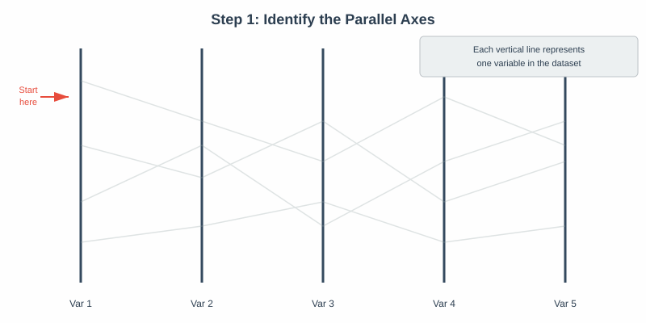
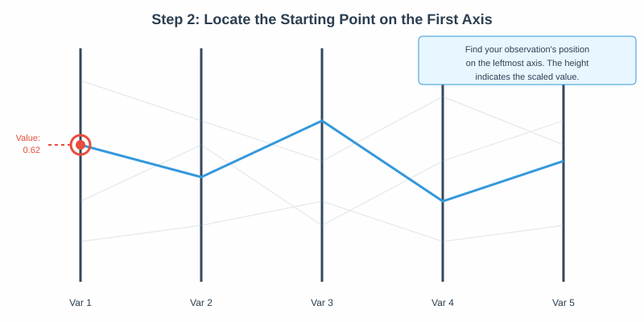
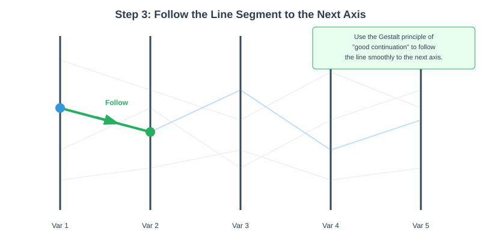
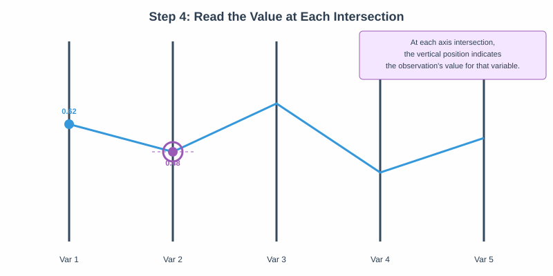
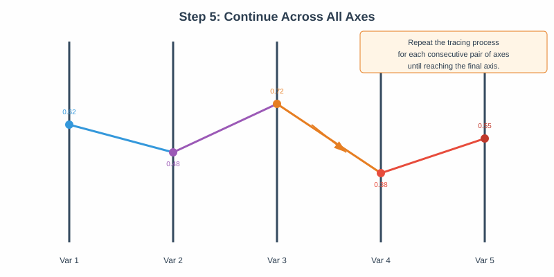
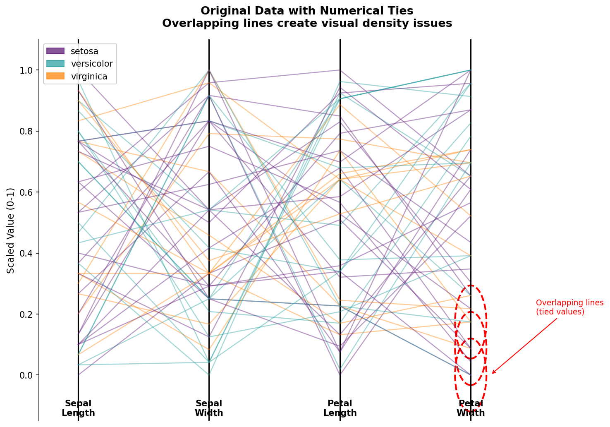
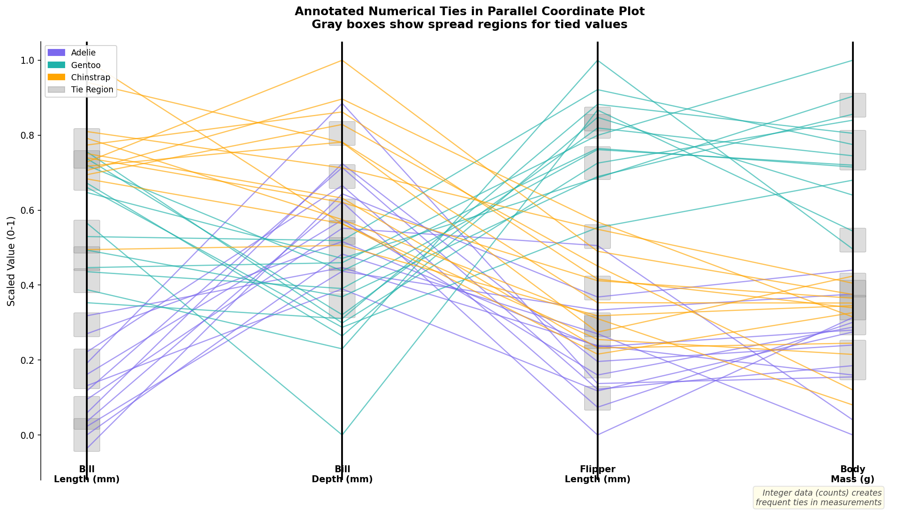
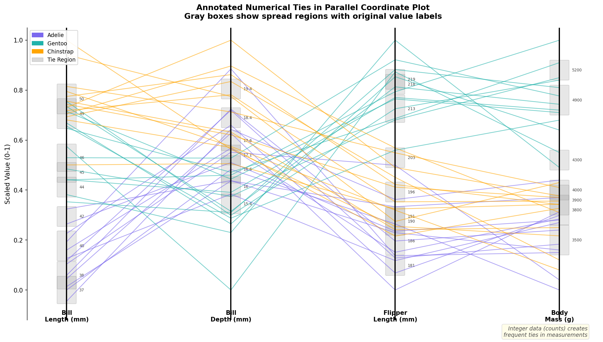
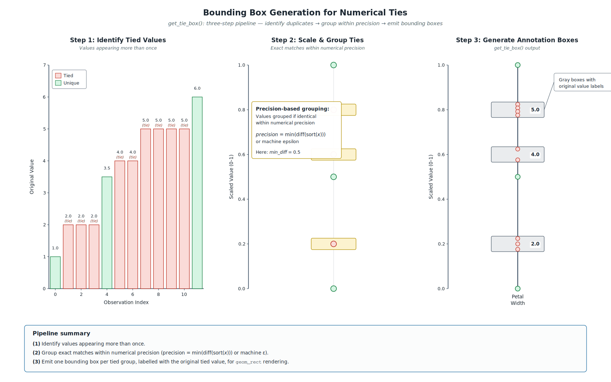

```{r setup, include=FALSE}
knitr::opts_chunk$set(
  echo = FALSE, 
  message = FALSE, 
  warning = FALSE,
  fig.width = 8,
  fig.height = 5,
  dpi = 300
)

# Load required packages
library(GGally)
library(palmerpenguins)
library(tidyverse)
library(gridExtra)
library(ggpcp)
library(datasets)
library(knitr)
library(kableExtra)
library(ggforce)

source(here::here("numerical_tie_attempts/toy_example.R"))


# Set theme
theme_set(theme_bw(base_size = 11))
```

# Introduction and Motivation

Parallel coordinate plots (PCPs) are a powerful technique for investigating patterns across multiple attributes (variables) simultaneously [@inselberg2009].
PCPs assign each dimension of an $n$-dimensional dataset to a vertical axis, with the axes arranged in parallel [@wegman1990]. 
Observations are drawn as polylines connecting a single point along each dimensional axis in sequence, providing a perspective on hard-to-visualize multidimensional data that can be used to identify clusters, outliers, and other facets of a dataset. 


When multiple observations share the same value in a given dimension, their polylines perfectly overlap at that changepoint, creating "visual collisions" that mask information about the joint distribution between variables and obscure the density along a single axis. 
The treatment of ties is an aspect not generally addressed in the original parallel coordinate plots of Inselberg [-@inselberg1985] and Wegman [-@wegman1990]. 

PCPs were canonically used to show continuous random variables, but their generalization to categorical data only exacerbated the problem.
Categorical parallel axis plot solutions, such as Sankey^[Sankey diagrams do not always have parallel axes, but they are visually similar and frequently use parallel axis constructions.] and Alluvial diagrams, Categorical PCPs [@pilhöfer2013], and Parallel Sets [@kosara2006] plots all developed as methods for using parallel axes to represent categorical, bivariate frequency information. Variations on these plots, such as common angle plots [@hofmann2013], address perceptual distortions that arise when line widths are evaluated along the vertical rather than the orthogonal direction, offering an alternative encoding that more faithfully communicates categorical association strengths.

Hammock plots [@schonlau2003], another type of PCP that accommodates categorical and continuous variables, shows multiple bivariate relationships using parallelograms drawn between axes, obviating the need for tie-breaking and preserving the density information. 
It is the parallelogram construction that creates the bivariate limitation.
Because only bivariate relationships are shown, it is not possible to mentally reconstruct the full joint distribution using a hammock plot.

The development of generalized PCPs (via the software implementation `ggpcp` [@vanderplas2023]) represents a major step forward in representing the full joint distribution of the data while showing individual observations. 
One innovation in the `ggpcp` package is the handling of ties in continuous variables: ties are broken and the observations are spread out within the box representing the marginal frequency of each value of the categorical variable. 
Sorting methods are implemented to distribute the tied values in a way that reduces the overall complexity of the plot, as random line-crossings can make PCPs difficult to read and interpret.

This project aims to extend the treatment of categorical variables in generalized PCPs, implementing a solution for the treatment of continuous variables which has the following properties:

- marginal density information (approximately) faithfully represented on the vertical axis
- individual lines can be visually distinguished, at least for data where the number of observations does not induce overplotting.

An immediate consequence of the second objective is that the viewer can, at least in theory, reconstruct the full joint distribution between variables from the plot. 
We will extend the method used in `ggpcp` to represent categorical data to continuous variables, modifying it to maintain the approximate scaling of the continuous variable, with slight local distortions when tied values occur.
In addition, we will develop a consistent visual representation to provide visual cues which indicate the presence of a local distortion due to tied values, while preserving the visual representation of singular values on the parallel axis.

This combination of the advantage of Hammock plots, maintaining the marginal density information,and generalized PCPs, which preserve individual observations and provide the ability to reconstruct the full joint distribution, will enhance GPCPs. 
Real-world data sets frequently have both categorical and numerical data, and duplicated values in either type of variable. 
Our extension to GPCPs will facilitate the visual representation of these data sets. 

## Related Work {#sec-related-work}

The parallel coordinate plot literature has developed several threads directly relevant to the tie-breaking problem addressed here. 

**Overplotting and density.** 
Early responses to visual overplotting in PCPs focused on transparency and kernel density estimation rather than positional adjustment. 
Alpha-blending, as used by Miller and Wegman [-@wegman1990], allows the density of overlapping lines to become visible through saturation, but sacrifices the ability to trace individual observations. 
More recent approaches include density-based rendering [@heinrich2013] and edge bundling [@mcdonnell2008], both of which trade individual traceability for aggregate clarity.

**Categorical extensions.** 
The categorical parallel axis plot literature developed largely independently of classical PCPs. 
Parallel Sets [@kosara2006] replaced individual polylines with ribbons whose widths encode bivariate frequencies, enabling unambiguous density reading at the cost of individual tracing. 
Alluvial diagrams [@brunson2020] and Sankey diagrams adopt a similar ribbon-based representation. 
Common angle plots [@hofmann2013] addressed a further perceptual distortion specific to variable-width ribbons: the Müller-Lyer family of line-width illusions causes ribbon widths evaluated along the vertical to appear systematically different from their orthogonal widths. 
By constraining ribbons to a constant angle, common angle plots recover perceptually accurate frequency judgments. 
Hammock plots [@schonlau2003; @schonlau2024] occupy a different position: they accommodate both categorical and continuous variables via constant-width parallelograms, but restrict inference to bivariate relationships between adjacent axes.

**Perceptual bounds on vertical displacement.** 
A separate and longstanding thread of the perceptual literature is potentially relevant to the question of how much spread the tie-breaking algorithm may safely introduce, though it is not intrinsic to the algorithm itself. 
The sine illusion, formalized by @day1991 and analyzed in the context of statistical graphics by @vanderplas2015, establishes that the vertical extent of a line segment is not perceived neutrally: when segments of equal length are arrayed along a curve, those at extrema appear systematically longer than those at intermediate positions. 
The illusion belongs to the Müller-Lyer family that also underwrites the line-width illusion treated by @hofmann2013 in their development of common angle plots. 
This is a concern that long predates the present work and arose independently of any tie-breaking method: common angle plots engaged with it as early as 2013 [@hofmann2013], well before the generalized-PCP machinery this proposal builds on. 
We therefore do not treat it as a design constraint on the band-width parameter $\sigma$ at this stage. 
Whether the sine illusion meaningfully affects within-band displacement here is an open empirical question, there are reasons to expect that continuous, traceable lines may largely avoid it, and we will need empirical tests (@sec-tolerance) before any perceptual bound on $\sigma$ can be justified.

**Axis and category ordering.** 
A well-studied property of PCPs is that axis order strongly affects both the number of line crossings and the interpretability of patterns [@vanderplas2023]. 
Minimizing line crossings through reordering is NP-hard in general [@murt2003], but heuristics based on correlation structure and sum of ranking differences provide tractable approximations [@ipkovich2021]. 
Within a fixed axis ordering, the order of factor levels and the plotting order of individual observations interact with tie-breaking: factor levels ordered to minimize crossings produce fewer extraneous crossings for any given tie-resolution strategy, while the `overplot` parameter in `ggpcp` controls which observations are rendered on top when lines overlap [@vanderplas2023]. 
These considerations interact directly with the hierarchical sorting approach developed in this proposal and are discussed further in @sec-sorting.

**Computational quality metrics.** 
Dennig et al. [-@dennig2021] formalized a suite of screen-space quality metrics for Parallel Sets—including ribbon overlap, crossing angle, orthogonality, and ribbon width variance—collectively termed ParSetgnostics. 
These metrics provide an empirical basis for comparing and optimizing parallel axis layouts without requiring user studies, and are candidate measures for the computational benchmarking component of our evaluation plan (@sec-benchmarking).

## Categorical Variables and Ties in `ggpcp`

The `ggpcp` package currently addresses categorical ties through a combination of sorting and tie-breaking algorithms. 
The package implements hierarchical sorting through the `pcp_arrange(data, method, space)` function, which orders observations based on a hierarchical application of variable values. 
The `method` parameter determines the sequence in which variables are considered when resolving ties in the arrangement. 
The `space` parameter specifies the proportion of the y-axis dedicated to empty space between levels of categorical variables (@fig-categorical-fix).

```{r}
#| label: fig-categorical-code
#| echo: true
#| eval: false


# 1. Modular Data Pipeline (The correct Step 1, 2, 3)
# Note: 'pcp_data' is used here as a variable name for the transformed object.
pcp_data <- mtcars %>%
  mutate(across(c(cyl, am, gear, carb), as.factor)) %>%
  pcp_select(cyl, am, gear, carb) %>%     # Step 1: Reshape data
  pcp_scale(method = "uniminmax") %>%     # Step 2: Scale axes
  pcp_arrange(method="from-left")         # Step 3: Break Ties, 
                                          #         sorting from left
```

```{r}
#| label: fig-categorical-fix
#| message: false
#| echo: false
#| output-location: column
#| fig-cap: "Comparison of tie-breaking methods for categorical variables in parallel coordinate plots using mtcars data. Standard PCP (top-left) shows overlapping lines without tie-breaking. GPCP with tie-breaking but no sorting (top-right) spreads observations evenly within categories. GPCP with sorting from left (bottom-left) and from right (bottom-right) apply hierarchical sorting to minimize line crossings, with light gray boxes indicating category groupings."

library(ggpcp)
library(ggplot2)
library(dplyr)
library(patchwork)
# 1. Modular Data Pipeline (The correct Step 1, 2, 3)
# Note: 'pcp_data' is used here as a variable name for the transformed object.
pcp_data <- mtcars %>%
  mutate(across(c(cyl, am, gear, carb), as.factor)) %>%
  pcp_select(cyl, am, gear, carb) %>%           # Step 1: Reshape data
  pcp_scale(method = "uniminmax")         # Step 2: Scale axes

p0 <- pcp_data %>%
ggplot(aes_pcp()) +
  geom_pcp(aes(color = cyl), alpha = 0.6) + 
  geom_pcp_boxes(boxwidth = 0.1, fill = "white", alpha = 0.5) +
  geom_pcp_labels() +
  theme_pcp() +
  labs(title = "Standard PCP", subtitle = "No Tie Breaking") + 
  guides(color="none")


# 2. Plotting with aes_pcp()
# Use aes_pcp() to automatically map the transformed pcp_x, pcp_y, and pcp_id variables.
p2 <- pcp_data %>%
  pcp_arrange("from-left") %>% # Sort from left
  ggplot(aes_pcp()) +
  geom_pcp(aes(color = cyl), alpha = 0.6) + 
  geom_pcp_boxes(boxwidth = 0.1, fill = "white", alpha = 0.5) +
  geom_pcp_labels() +
  theme_pcp() +
  labs(title = "GPCP: Cat. Ties + Sorting", subtitle = "Sort from left") + 
  guides(color="none")


p3 <- pcp_data %>%
  pcp_arrange("from-right") %>% # Sort from right
  ggplot(aes_pcp()) +
  geom_pcp(aes(color = cyl), alpha = 0.6) + 
  geom_pcp_boxes(boxwidth = 0.1, fill = "white", alpha = 0.5) +
  geom_pcp_labels() +
  theme_pcp() +
  labs(title = "GPCP: Cat. Ties + Sorting", subtitle = "Sort from right") + 
  guides(color="none")

pcp_data2 <- mtcars %>%
  mutate(across(c( cyl, am, gear, carb), as.factor)) %>%
  pcp_select(cyl, am, gear, carb) %>%
  pcp_scale(method = "uniminmax") %>%     # Step 2: Scale axes
  pcp_arrange("from-right") %>% # Sort from right
  # This shuffles everything within category, ensuring no sorting persists
  group_by(pcp_x, pcp_level) %>%
  mutate(order = permute::shuffle(n()),
         pcp_y = pcp_y[order],
         pcp_yend = pcp_yend[order])

p1 <-  pcp_data2 %>%
  # ungroup() %>%
  # pcp_arrange_opts(method="none", .by_group = F) %>% # No sorting - overwrote pcp_arrange()
  ggplot(aes_pcp()) +
  geom_pcp(aes(color = cyl), alpha = 0.6) + 
  geom_pcp_boxes(boxwidth = 0.1, fill = "white", alpha = 0.5) +
  geom_pcp_labels() +
  theme_pcp() +
  labs(title = "GPCP: Tie Breaking", subtitle = "No sorting") + 
  guides(color="none")

p0 + p1 + p2 + p3
```


The ability to follow individual observations is key to being able to reconstruct the full joint distribution across parallel axes. 
`ggpcp` creates equally spaced points within each category that span the portion of the vertical axis dedicated to the category (preserving the marginal frequency information, which is optionally emphasized with `geom_pcp_boxes`). 
The top left plot in @fig-categorical-fix shows the PCP without this categorical tie-breaking approach. 
However, `ggpcp` goes one step further by using hierarchical sorting (from the left, right, or both) to minimize unnecessary line crossings induced by the treatment of tied categorical variables. 
The absence of the hierarchical sorting approach is emphasized in the top right plot in @fig-categorical-fix, while the bottom left and right plots show sorting from the left and right respectively. 
This hierarchical sorting approach serves as a form of "external cognition," reducing the cognitive load required to "untangle" and group crossed lines. 
The sorting also ensures that only necessary crossings^[A crossing is necessary if it is induced by the order of x-axis variables and scaled values, rather than by the treatment of categorical variables.] occur, minimizing visual clutter.

It is worthwhile to examine how a viewer would follow a line across the plot in detail, using a generalized PCP with both numeric and categorical variables to illustrate the challenges introduced when numerical ties are present.

::: {layout="[[30,-5,30,-5,30],[30,-5,30]]" .pcp-trace-grid}

{#fig-figure-1 width="90%"}

{#fig-figure-2 width="90%"}

{#fig-figure-3 width="90%"}

{#fig-figure-4 width="90%"}

{#fig-figure-5 width="90%"}

:::

```{=html}
<style>
.pcp-trace-grid figure { margin-right: 1.5em; margin-bottom: 1.2em; }
.pcp-trace-grid figcaption { padding: 0 0.75em; }
</style>
```
```{=latex}
\captionsetup[subfigure]{margin=0.75em}
```

```{r}
#| include: false

# This chunk is just to get the pdf that can be imported into Inkscape for generating the figure sequence...
my_mtcars <- mtcars %>%
  mutate(across(c(cyl, am, gear), as.factor)) %>%
  mutate(am = factor(am, levels = c(1, 0), ordered = T),
         inv_wt = -wt) 
pcp_data <- my_mtcars %>%
  pcp_select(cyl, am, mpg, qsec, inv_wt, gear, drat) %>%          
  pcp_scale(method = "uniminmax") %>%
  pcp_arrange()

p <- pcp_data %>%
  pcp_arrange("from-left") %>% # Sort from left
  ggplot(aes_pcp()) +
  geom_pcp(aes(color = cyl), alpha = 0.6) + 
  geom_pcp_boxes(boxwidth = 0.1, fill = "white", alpha = 0.5) +
  geom_pcp_labels() +
  theme_pcp() + 
  guides(color="none")
ggsave("images/pcp_orig_ggplot2.pdf", p, width=8, height=4, units="in")
```

```{r}
#| include: false
#| eval: false
#| 

# 1. Data Preparation
my_mtcars <- mtcars %>%
  mutate(across(c(cyl, am, gear), as.factor)) %>%
  mutate(am = factor(am, levels = c(1, 0), ordered = TRUE),
         inv_wt = -wt) 

pcp_data <- my_mtcars %>%
  pcp_select(cyl, am, mpg, qsec, inv_wt, gear, drat) %>%          
  pcp_scale(method = "uniminmax") %>%
  pcp_arrange()

# 2. Select exactly 6 rows to highlight
# You can slice(1:6) or select specific indices that show interesting bifurcations
highlight_lines <- pcp_data %>% 
  dplyr::slice(1:3) 

# 3. Create the Plot
pcp_data %>%
  pcp_arrange("from-left") %>% 
  ggplot(aes_pcp()) +
  # Background: All lines, heavily de-emphasized to clear the "wire-heavy" look 
  geom_pcp(aes(color = cyl), alpha = 0.05, size = 0.2) + 
  
  # THE HALO: Thicker white lines to separate the 6 traces from the background 
  geom_pcp(data = highlight_lines, 
           color = "white", 
           alpha = 0.8, 
           size = 2.5, 
           over = 0) +
  
  # THE TRACE: The 6 specific lines 
  # 'over = 0' ensures they don't merge/bundle, showing individual path splits 
  geom_pcp(data = highlight_lines, 
           aes(color = cyl), 
           alpha = 1, 
           size = 1.2, 
           over = 0) +
  
  # Structural elements: Boxes and Labels to anchor numerical ties 
  geom_pcp_boxes(boxwidth = 0.1, fill = "white", color = "gray90", alpha = 0.5) +
  geom_pcp_labels() +
  
  # Formatting
  scale_color_manual(values = c("4" = "#1f78b4", "6" = "#e31a1c", "8" = "#33a02c")) +
  theme_pcp() + 
  guides(color = "none") +
  labs(title = "Six-Path PCP Trace",
       subtitle = "Tracing specific observations to highlight multi-axis bifurcations")


```


- Step 1: Identify the Parallel Axes (@fig-figure-1).    
Begin by identifying each vertical axis in the plot. 
Each axis represents one variable from the dataset. 
The axes are typically arranged from left to right, and the order may be determined by the data analyst to highlight specific relationships or minimize visual clutter.

- Step 2: Locate the Starting Point (@fig-figure-2).    
Find the observation of interest on the leftmost axis. 
The vertical position indicates the scaled value of that observation for the first variable. 
If you are examining a highlighted or color-coded observation, look for its distinctive marker at this starting position.

- Step 3: Follow the Line Segment (@fig-figure-3).    
Trace the line segment from the starting point to its intersection with the next axis. 
The human visual system naturally follows smooth, continuous paths due to the Gestalt principle of good continuation, which allows viewers to perceive connected line segments as a single, piecewise continuous line, making it easier to track observations across multiple parallel axes.

- Step 4: Read Values at Intersections (@fig-figure-4).    
At each axis intersection, the vertical position of the line indicates the observation's value for that variable. Read these values to understand how the observation changes (typically, relative to the other observations) across different dimensions of the data. 
The slope of line segments between axes provides information about the relationship between consecutive variables for that specific observation.

- Step 5: Continue Across All Axes (@fig-figure-5).    
Repeat the tracing process for each consecutive pair of axes until reaching the rightmost axis. 
By following the complete path, you obtain a comprehensive view of how that particular observation behaves across all measured variables. 
The vertical positions along each axis represent scaled values that can be interpreted as quantiles when the data are appropriately transformed. 
This enables identification of unique characteristics, cluster membership, or outlier status.

{#fig-figure-6 width="90%"}

- Step 6: Ties in Numbers — A Fork in the Road (@fig-figure-6).

What was once a single point now becomes the starting point for two separate line segments that go in different directions. 
The Gestalt principle of good continuation doesn't work anymore when two or more lines come from the same point on an axis. 
In this configuration, color is the only channel that can provide separate line identity across the tie and even then, only when the palette is carefully chosen. 
The visual continuity that made tracing easy in earlier steps breaks down exactly where it is needed most. 
The observer cannot tell if the original observation follows the upper branch or the lower branch of the fork unless there are more visual cues, like color coding, clear labels, or a systematic tie-breaking arrangement. 
This lack of clarity is not just an aesthetic problem; it also makes it harder for the user to identify patterns that would be difficult to see in tabular data by following individual observations through high-dimensional space.
This ability to trace individual observations is one of the central reasons parallel coordinate plots are useful.


## Addressing Numerical Ties


```{r}
#| label: fig-working-theory
#| echo: false
#| fig-width: 9
#| fig-height: 4
#| fig-cap: "Comparison of a standard PCP with overlapping ties (left) and the proposed
#|   tie-breaking algorithm with `from-left` hierarchical sorting (right). Tied
#|   observations on Year B are spread within a resolution-based interval (blue boxes)
#|   and ordered by their Year A values, eliminating within-band crossings. A visible
#|   gap is preserved between the tie bands for 2000 and 2001: separation between bands
#|   is essential for the Gestalt grouping argument to hold, since adjacent bands that
#|   touch would visually merge and the reader would lose the ability to distinguish
#|   distinct values. The band width is therefore set strictly below the global axis
#|   resolution $\\delta_j$. Remaining crossings are necessary crossings induced by
#|   the data structure rather than artifacts of tie-breaking."

library(ggplot2)
library(dplyr)
library(patchwork)

# ── 1. Raw data ───────────────────────────────────────────────────────────────
raw <- tibble(
  id    = 1:18,
  yearA = c(1990, 1991, 1993, 1995, 1996, 1997,
            1998, 1999, 2000, 2001, 2002, 2003,
            2003, 2004, 2004, 2005, 2006, 2007),
  yearB = c(1980, 1980, 1980, 1980, 1980, 1980,
            2000, 2000, 2000, 2000, 2000, 2000,
            2001, 2001, 2001, 2001, 2001, 2001),
  value = c(15,   40,   60,   25,   80,   50,
            35,   70,   20,   90,   45,   65,
            30,   55,   85,   10,   75,   95)
)

# ── 2. Scale to [0, 1] ────────────────────────────────────────────────────────
s01 <- function(x) (x - min(x)) / (max(x) - min(x))
dat <- raw %>% mutate(sA = s01(yearA), sB = s01(yearB), sV = s01(value))

# ── 3. Axis resolution & spread width ────────────────────────────────────────
# A visible gap between adjacent tie bands is essential for the Gestalt argument:
# bands that touch at the 2000/2001 boundary would visually merge, collapsing the
# very separation the reader is meant to perceive. We therefore take the band
# width as a fraction of the global axis resolution, leaving the remainder as gap.
uB         <- sort(unique(dat$sB))     # scaled positions: 1980, 2000, 2001
delta      <- min(diff(uB))            # smallest gap between distinct values (2000–2001)
band_frac  <- 0.55                     # band occupies 55% of delta; 45% remains as gap
spread     <- delta * band_frac

# ── 4. From-left tie-breaking on Year B ───────────────────────────────────────
dat_broken <- dat %>%
  group_by(sB) %>%
  arrange(sA, .by_group = TRUE) %>%
  mutate(
    n    = n(),
    rank = row_number(),
    lo   = pmax(0,  sB - spread / 2),
    hi   = pmin(1,  sB + spread / 2),
    sBk  = if_else(n == 1L, sB, lo + (rank - 1L) / (n - 1L) * (hi - lo))
  ) %>%
  ungroup()

# ── 5. Long format ────────────────────────────────────────────────────────────
to_long <- function(d, broken = FALSE) {
  yB <- if (broken) d$sBk else d$sB
  bind_rows(
    tibble(id = d$id, x = 1, y = d$sA),
    tibble(id = d$id, x = 2, y = yB),
    tibble(id = d$id, x = 3, y = d$sV)
  )
}
long_before <- to_long(dat,        broken = FALSE)
long_after  <- to_long(dat_broken, broken = TRUE)

# ── 6. Colours (colour-blind safe) ───────────────────────────────────────────
obs_cols <- c(
  "1" = "#E69F00", "2" = "#56B4E9", "3" = "#009E73",
  "4" = "#CC79A7", "5" = "#0072B2", "6" = "#D55E00"
)

# ── 7. Year B reference: breaks and labels for the secondary axis ─────────────
yB_breaks <- uB
yB_labels <- c("1980", "2000", "2001")

# ── 8. Tie boxes (after panel only; singleton at 2001 receives no box) ────────
tie_boxes <- dat_broken %>%
  group_by(sB) %>%
  filter(n() > 1) %>%
  summarise(lo = first(lo), hi = first(hi), .groups = "drop") %>%
  transmute(xmin = 1.87, xmax = 2.13, ymin = lo, ymax = hi)

# ── 9. Shared theme ───────────────────────────────────────────────────────────
pcp_theme <- theme_bw(base_size = 10) +
  theme(
    panel.grid         = element_blank(),
    axis.text.y.left   = element_blank(),
    axis.ticks.y.left  = element_blank(),
    axis.title         = element_blank(),
    plot.title         = element_text(size = 10, face = "bold", hjust = 0.5),
    # Secondary axis: Year B reference labels, rendered in the right margin
    axis.text.y.right  = element_text(size = 7.5, colour = "grey35"),
    axis.ticks.y.right = element_line(colour = "grey50", linewidth = 0.3),
    axis.title.y.right = element_text(size = 8, colour = "grey40",
                                       angle = 270, vjust = 0.5)
  )

# ── 10. Plot factory ──────────────────────────────────────────────────────────
make_pcp <- function(long, title, boxes = NULL) {

  p <- ggplot(long, aes(x, y, group = id, colour = factor(id))) +
    # Tie boxes drawn first so lines render on top
    geom_vline(xintercept = c(1, 2, 3), colour = "black", linewidth = 0.5) +
    geom_line(linewidth = 0.8, lineend = "round") +
    scale_colour_manual(values = obs_cols, guide = "none") +
    scale_x_continuous(
      breaks = 1:3,
      labels = c("Year A", "Year B", "Value"),
      limits = c(0.55, 3.45),
      expand = c(0, 0)
    ) +
    # Primary y-axis: unlabelled (PCP convention)
    # Secondary y-axis: Year B reference — rendered in the margin, never overlaps lines
    scale_y_continuous(
      limits   = c(-0.05, 1.05),
      expand   = c(0, 0),
      breaks   = NULL,
      sec.axis = sec_axis(
        transform = ~ .,
        breaks    = yB_breaks,
        labels    = yB_labels,
        name      = "Year B"
      )
    ) +
    # Small tick marks on the Year B axis itself for visual anchoring
    annotate("segment",
             x = 1.97, xend = 2.03,
             y = yB_breaks, yend = yB_breaks,
             colour = "grey40", linewidth = 0.45) +
    labs(title = title) +
    pcp_theme

  if (!is.null(boxes)) {
    p <- p + geom_rect(
      data      = boxes,
      aes(xmin = xmin, xmax = xmax, ymin = ymin, ymax = ymax),
      inherit.aes = FALSE,
      fill      = "#AED6F1",
      colour    = "#2471A3",
      alpha     = 0.35,
      linewidth = 0.5
    )
  }

  p
}

p_before <- make_pcp(long_before, "Before: Exact Values")
p_after  <- make_pcp(long_after,  "After: From-Left Sorting", tie_boxes)

p_before + p_after
```

Two implementation details in @fig-working-theory deserve explicit comment because both are load-bearing for the Gestalt argument that motivates the spreading. 
First, each tie band must be strictly narrower than the gap to its nearest neighbor: if the band around $v = 2000$ extended up to meet the band around $v = 2001$, the two values would visually fuse, defeating the separation the spread was meant to make visible. 
The band width in the figure is therefore set to a fraction of the axis resolution $\delta_j$, leaving a deliberate gap between adjacent bands. 
Second, the reader must be able to *see* that gap, not merely have it exist in the coordinate system. 
This is a Gestalt-of-proximity requirement: the gap must lie above the just-noticeable-difference (JND) threshold and so cannot be shrunk to an infinitesimally small size. 
If ties at adjacent values are rendered without a perceptible gap, the grouping cue that "observations within a band share a value" competes with the unintended cue that "bands adjacent to one another belong to the same group." 
The mathematical formalization of this separation requirement appears in Step 3 of the algorithm (@sec-math-step3).


The `ggpcp` package implements a tie-breaking algorithm for categorical variables that maintains individual observation traceability by spacing observations evenly within each categorical level:

> "All observations are spaced out evenly. This results in a natural visualization of the marginal frequencies along each axis (additionally enhanced by the light gray boxes grouping observations in the same category) that is not as prominent in the previous three panels. The ordering of the observations within the level is such that a minimal number of line crossings occurs between the axes." (p. 11)

This even spacing along the axis is what produces the horizontal-segment appearance within a level and lets the box height read as the marginal proportion at that axis point.
The sorting is described as *hierarchical* not as a stylistic choice but out of necessity: the levels must be processed in order for the arrangement to reduce line crossings across the plot as a whole.
`ggpcp` does permit lines to break and cross within an otherwise horizontal segment, but this is not recommended, precisely because it undercuts the marginal-proportion reading that the horizontal arrangement is meant to support.

Even spacing alone, however, is not sufficient: without a principled ordering within each tie band, lines departing toward different positions on the neighboring axis will cross *inside* the band.
The hierarchical sorting that resolves this is the subject of @sec-sorting; the spacing formula used for categorical levels is:


![Spacing parameters for a categorical axis. Each level $i$ is allocated total height $S_i$, with margins $S_i^+$ above and $S_i^-$ below reserved for inter-level separation. The remaining vertical extent is divided into $n_i - 1$ intervals to seat $n_i$ observations at uniform spacing $d_i$. The parameter-key panel on the right indicates how each quantity is determined: $S_i$ is set by the level's frequency proportion under a user-chosen total budget, $S_i^\pm$ are user-controlled via the `space` argument, $n_i$ is the level frequency, and $d_i$ is derived from the formula at the bottom. The numerical analog of this figure (@fig-figure-7) shares the same layout, color encoding, and formula structure; the differences are confined to how each parameter is set.](images/pcp_line_tracing_guide_images/spacing_categorical.png){#fig-spacing width="90%"}

$$d_i = \frac{S_i - S_i^- - S_i^+}{n_i - 1}$$

where:

-   $S_i$ is the total space allocated to category $i$
-   $S_i^-$ is the spacing below category $i$
-   $S_i^+$ is the spacing above category $i$
-   $n_i$ is the number of observations in category $i$
-   $d_i$ is the optimal spacing distance between consecutive observations

The spacing formula above is the categorical workhorse: each level $i$ is allocated total height $S_i$, lower and upper margins $S_i^-$ and $S_i^+$ are subtracted to enforce inter-level separation, and the remaining vertical extent is divided into $n_i - 1$ intervals to seat $n_i$ observations.
The proposed numerical framework adopts the same five quantities and the same formula structure, redefining only what determines each parameter; the full mapping is given in @sec-unified (@tbl-unified).
@fig-figure-7 displays the numerical version using the same parameter-key conventions as @fig-spacing, so the two figures can be laid side by side and read as a single procedure with type-specific instantiations rather than as two separate algorithms that happen to share an idea.


A key visual difference emerges when connecting categorical to numerical variables. 
@schonlau2024 observe:

> "When many observations have the same value for a categorical and an adjacent numerical variable, the corresponding area looks like a triangle... Notice the lines/boxes between the variables hospitalizations and comorbidities in the GPCP (Figure 13) and hammock plots (Figure 2). Most of the observations are in the boxes leading from hospitalizations=0 to either comorbidities=0 or comorbidities=1. This is far more obvious in the hammock plot than in the GPCP plot." (p. 19)

Whether the transition takes a triangular or rectangular form is perhaps less important than what it communicates about the data itself. 
The more interesting question is whether the visualization preserves density information while still allowing viewers to follow individual observations. 
When observations flow from a categorical box toward numerical values, tie-breaking on the numerical axis shapes how clearly we can perceive the underlying distribution.

The `ggpcp` package tackles this challenge through its tie resolution parameters. 
The `space` parameter controls vertical spacing between tied values, and the `method` parameter governs how those values are ordered. 
Used well, these parameters spread observations along the numerical axis much like a rug plot would, giving readers a sense of density while keeping individual paths traceable.
This represents a different set of trade-offs than hammock plots, which use constant-width parallelograms to show marginal densities directly. 
Rather than foregrounding aggregate density, `ggpcp` keeps individual observation lines intact and relies on thoughtful spacing to convey distributional structure. 
The result is a visualization that supports both seeing the forest and examining particular trees.

The preceding review of categorical tie-breaking, together with the related work in @sec-related-work, sets the stage for a formal specification of the research questions this proposal addresses.

## Research Questions {#sec-rq}

The preceding review motivates three formal research questions that structure the remainder of this proposal.

**RQ1 (Algorithm correctness).** 
Does the `tie_spread` algorithm distribute tied observations within resolution-based intervals in a way that (a) preserves marginal frequency information through within-band dot density and (b) eliminates within-band line crossings through hierarchical sorting?

**RQ2 (Frequency perception).** 
Do viewers make more accurate frequency judgments—for magnitude estimation, ordinal comparison, and ratio tasks—when examining a GPCP with numerical tie-breaking than when examining an equivalent hammock plot?

**RQ3 (Individual traceability).** 
Does numerical tie-breaking in GPCPs improve viewers' ability to follow a single observation across all axes, relative to a standard PCP without tie-breaking, without sacrificing the density information conveyed by the marginal axis representation?

RQ1 is addressed computationally through the algorithm development and visual inspection phases (Phase 1 and Phase 3, @sec-phase1 and @sec-benchmarking). 
RQ2 and RQ3 are addressed through the perceptual validation study (Phase 2). 
We pre-specify directional hypotheses for RQ2 and RQ3: we anticipate that GPCP with tie-breaking will produce lower absolute percentage error on magnitude estimation tasks (RQ2) and higher tracing accuracy (RQ3) than the respective baselines, with effect sizes consistent with a medium Cohen's $d$ based on prior graphical perception literature.

# An Approach to Numerical Ties

Currently, numerical variables disrupt some of the best innovations in the GPCP approach by making it impossible to track an observation across the plot and by obscuring marginal density information through overplotting. 
The remaining two chapters of the dissertation will address the handling of ties on numerical axes and assess the utility of visual cues that can be paired with the tie breaking method to indicate that values are approximately accurate spatially and equivalent numerically.

The `ggpcp` package does not currently provide a mechanism for resolving these tied values. 
We propose `tie_spread`, an algorithm that distributes observations with identical values along the vertical axis, transforming overlapping lines into a visually resolvable spread. 
Consistent with tidyverse conventions and the tidyselect grammar, the implementation allows users to specify tie-breaking behavior selectively across axes—applying spreading to some variables while preserving exact positioning on others. 
Sensible defaults balance visual clarity against faithful representation of the underlying data, ensuring that users can immediately benefit from improved legibility without extensive parameter tuning. 
The following section details the design and implementation of this approach.


## The Problem: Overlapping Lines

When multiple observations share the same value on a numerical axis, their polylines converge to a single point, and the two failures noted in the introduction recur in their most acute form: individual traceability is lost, and marginal density is obscured (@fig-figure-6). 
The problem is especially severe for integer-valued or coarsely-measured variables, where ties are structurally common rather than incidental.

The `tie_spread` algorithm resolves this by distributing tied observations within a vertical allocation anchored to the axis resolution $\delta_j$ — the smallest distance between any two distinct values on the axis — rather than within a frequency-proportional band. 
Every value receives the same allocation, with equal margins reserved above and below so that a perceptible gap is preserved between adjacent value bands and the tied observations are spread evenly across the interior. 
@fig-figure-7 gives the parameters; the formal construction is set out in @sec-math-step3, and its correspondence to the categorical algorithm already in `ggpcp` is tabulated in @sec-unified. 
The consequential design choice is what the allocation encodes: marginal density on a numerical axis is carried by the *dot density within each band* rather than by the *vertical extent of each band*. 
This preserves the natural numerical ordering on the axis and avoids the perceptual distortion that variable-height bands at fixed numerical positions would introduce.

![Spacing parameters for a numerical axis, displayed in the same layout as @fig-spacing so the two frameworks read as a single procedure with type-specific instantiations. Each unique value $v$ receives a vertical allocation of height $S(v) = \delta_j$, with margins $S^+(v)$ above and $S^-(v)$ below — both fixed at $(1 - \sigma) \cdot \delta_j / 2$ — that preserve the inter-band gap. The remaining inner region of height $\sigma \cdot \delta_j$ is divided into $n(v) - 1$ intervals to seat $n(v)$ tied observations at uniform spacing $\Delta(v)$. The mapping to @fig-spacing is direct: $S_i \leftrightarrow S(v)$, $S_i^\pm \leftrightarrow S^\pm(v)$, $n_i \leftrightarrow n(v)$, $d_i \leftrightarrow \Delta(v)$, and the spacing formula at the bottom is structurally identical. The innovation, visible in the parameter-key annotations, is in how each quantity is determined: $S(v)$ is anchored to the global axis resolution rather than to frequency, and $S^\pm(v)$ are derived from the separation parameter $\sigma$ rather than user-controlled by default.](images/pcp_line_tracing_guide_images/spacing_numerical.png){#fig-figure-7 width="90%"}

@fig-numerical-in-context shows the parameter spec of @fig-figure-7 applied to a small parallel coordinate plot. Variable B carries three tied groups at $v \in \{0.8, 0.5, 0.2\}$, with $n(v) = 5, 3, 2$ observations respectively. 
All three bands have the same vertical allocation $S(v) = \delta_j$, regardless of $n$, the algorithm encodes marginal density through dot density within the band, not through band height. 
The figure illustrates `from-right` processing, the complement of the `from-left` mode used in @fig-working-theory, so that observations within each band are placed in the order determined by their values on Variable C, the right neighbor. 
The polylines emerging from the band onto Variable C therefore carry no avoidable crossings; the within-band rank is the visible signature of the hierarchical sorting introduced in @sec-sorting. 
Together the two figures illustrate that the algorithm is symmetric: the same construction applies under either processing direction, with the role of the reference axis swapped.


![The algorithm of @fig-figure-7 applied to a small parallel coordinate plot. Three tied groups on Variable B, with $n(v) = 5, 3, 2$, are spread within bands of identical vertical allocation $S(v) = \delta_j = 0.30$. The top band carries the parameter-reference annotations ($S(v)$, $\Delta(v)$, the yellow $S^\pm(v)$ margin strips); the mid and bot bands are shown as plain inner regions to keep the visual uncluttered. The solid horizontal line and "v = $\cdot$" label at each band's center mark the actual tied value, against which the within-band spread is the algorithm's displacement of each tied observation. Within each band, the from-right ordering rule places the observation with the highest value on Variable C at the top of the band and the lowest at the bottom, so that polylines emerging from the band onto Variable C run in monotone order. Polylines are drawn as straight segments between axes; distinct colors per observation allow individual polylines to be traced through the tied region — the legibility property the algorithm is designed to preserve.](images/pcp_line_tracing_guide_images/spacing_polyline.png){#fig-numerical-in-context width="100%"}

## Hierarchical Sorting for Minimal Crossings {#sec-sorting}

Spreading tied values evenly across a resolution-based interval is a necessary first step, but it is not, by itself, sufficient to eliminate visual knots. 
When the order of assignment within the tie band is arbitrary, lines departing toward different positions on the neighboring axis will cross inside the band, reproducing the very confusion the spreading was meant to resolve. 
The `ggpcp` package resolves this through hierarchical sorting that mirrors the approach already used for categorical variables.

For the `from-right` processing mode, the mode directly applicable to @fig-working-theory, each tied observation $i \in T_j(v)$ is ranked by its adjusted position on the right neighbor axis, $\kappa_i = \tilde{y}_{i, A_j}$ (see @eq-sortkey). 
Positions within the tie band are then assigned in the same rank order, from lowest to highest. 
This monotone rank-matching guarantees that no two lines cross within the tie band: the observation that arrives lowest on the right axis is placed lowest in the band, the next-lowest observation is placed next, and so on. 
Any crossings that remain after sorting are *necessary* crossings, those induced by the data structure itself rather than by the mechanics of tie-breaking.

By ordering observations within a tie group according to their values on adjacent axes, `ggpcp` produces locally parallel bundles of lines. 
Observations with similar trajectories are positioned in close proximity, so distinct groups are perceived as coherent bands moving together through high-dimensional space, an instance of the Gestalt principle of common fate.^[Common fate is usually defined in terms of motion, so applying it to a static display is a slight stretch; we think it is defensible here, because the eye reads the parallel bundle as moving together across axes. The Gestalt cue of *similarity* offers an alternative framing of the same effect that does not depend on attributing motion, and may meet less resistance.] 
This reduces visual noise and highlights underlying patterns.

**Interaction with axis ordering.** 
The effectiveness of hierarchical sorting is closely intertwined with axis order and direction. 
@vanderplas2023 note that the order of factor levels is an important determinant of residual line crossings: some crossings are attributable to the data structure itself and cannot be eliminated by within-category sorting, while others arise from an unfavorable factor ordering and can be removed by reordering levels.
Factor-level ordering is, helpfully, not an issue for numerical variables, there are no levels to reorder. 
Our tie-breaking extension therefore inherits a narrower dependency: for numerical axes, the minimum number of necessary crossings is a function of the scaled data values and the sequence (and direction) in which axes are processed. 
Users should therefore consider axis ordering as a precondition for optimal tie-breaking, particularly when integer-valued variables with many ties are adjacent to continuous variables with high variance. 
(`ggpcp` allows users to reorder factor levels via `mutate` before variable selection and to reverse axes to reduce negatively correlated crossings; the latter remains relevant for numerical axes.)

![Comparison of parallel coordinate plots without (left) and with (right) numerical tie-breaking using `from-right` hierarchical sorting. When observations share the same numerical value, their lines overlap completely (left), hiding how many cases exist at that value. Spreading tied values within resolution-based boxes (blue) and sorting by the right neighbor axis (right) makes each observation visible, eliminates crossings within the tie band, and signals that positions within the box are artifacts of tie-breaking rather than meaningful data variation.](images/pcp_line_tracing_guide_images/pcp_tiebreaking_updated.png){#fig-figure-8 width="75%"}

## Gestalt Principles and Line Continuity

The principle of good continuation states that the human visual system preferentially perceives smooth, continuous contours over interpretations requiring abrupt changes in direction. 
This principle directly impacts the effectiveness of parallel coordinate plots for tracing individual observations.

Equispaced lines maintain continuity by representing each observation as a continuous polyline extending from the leftmost to the rightmost axis. 
When observations share identical numerical values (ties), the equispacing mechanism distributes lines within each category so that they remain visually distinct without introducing discontinuities. 

Constant-width boxes represent observations as aggregated area segments rather than individual lines. 
This encoding communicates aggregate quantities effectively: the area of each segment is proportional to the number of observations sharing that combination of values across adjacent axes, making the joint frequencies of category pairs immediately visible. 
In contrast, equispaced lines preserve individual observations as distinct visual elements. 
When lines are continuous and uninterrupted, viewers can leverage preattentive processes such as the Gestalt principle of good continuation to trace a single case across all axes [@healey2012]. 
The two approaches thus serve distinct purposes: lines support individual-level tracing through low-level perceptual grouping, while boxes support aggregate-level frequency comparison. 
The conditions under which each is optimal are taken up in the conclusion.

## Visual Cue Design {#sec-visual-cues}

The introduction committed to developing "a consistent visual representation to provide visual cues which indicate the presence of a local distortion due to tied values." 
This section specifies the design rationale for those cues, building on the perceptual principles outlined in the preceding section.

When tied values on a numerical axis are spread within a resolution-based interval, each line is displaced from its true value to a within-band position; that displacement is an artifact of tie-breaking rather than a reflection of meaningful data variation. 
A viewer who is unaware of this may misread the displacement as genuine within-group variance. 
The visual cue must therefore accomplish two things simultaneously: it must make the presence of a tie region legible without disrupting the tracing of individual lines through the region.

The design adopted here uses a light gray bounding box, anchored at the lower and upper bounds of the resolution interval $[L(v), U(v)]$, as illustrated in @fig-uniform-spacing and @fig-annotated. 
This choice follows directly from the categorical tie-breaking convention already implemented in `ggpcp`, where gray boxes group observations within each categorical level. 
Extending the same visual element to numerical tie regions creates a unified grammar: a gray box in any axis region signals "these positions are spread for legibility, not because the underlying values differ." 
This consistency reduces the cognitive overhead required to interpret mixed categorical-numerical plots.

Three alternative cue designs were considered and set aside. 
A color change on tied lines would require an additional channel already commonly used for group membership. 
A texture fill would introduce ambiguity on screen at small box heights. 
A dashed axis segment at the tied value would mark the location but not the extent of the spread, making it difficult to recover the original value. 
The gray box avoids all three problems: it marks both the location (the center of the box corresponds to the tied value) and the extent (the box height reflects $\delta_j$, the global axis resolution), and it does not consume an encoding channel needed elsewhere.

The detection-and-rendering of these boxes can be expressed as a short pipeline that consumes the output of the tie-breaking step: identify values that appear more than once on a given axis, group contiguous spreads at numerical precision, and generate bounding-box coordinates for `geom_rect` rendering. 
An optional `label` argument displays the original tied value at the center of each box, which is particularly informative for integer-valued variables where many values may be tied at round numbers. 
(Whether this box geom is best implemented as a standalone layer or as a `ggproto` extension inheriting from the existing categorical box geom is taken up in Phase 1; see @sec-impl.)


# Mathematical Framework

{#fig-original-ties width=85%}

## Notation

Let $\mathcal{D}$ be a dataset with $n$ observations and $p$ variables displayed on parallel axes $X_1, X_2, \ldots, X_p$.

| Symbol | Definition |
|--------|------------|
| $x_{ij}$ | Raw value of observation $i$ on variable $j$ |
| $y_{ij}$ | Scaled value (normalized to $[0,1]$) |
| $\tilde{y}_{ij}$ | Adjusted value after tie-breaking |
| $T_j(v)$ | Set of observations tied at value $v$ on axis $j$ |
| $k$ | Number of tied observations: $k = |T_j(v)|$ |
| $\delta_j$ | Resolution of axis $j$: minimum distance between distinct values |

: Core notation {#tbl-notation}

## Scaling

Variables are normalized to $[0,1]$ using min-max scaling:

$$
y_{ij} = \frac{x_{ij} - \min(X_j)}{\max(X_j) - \min(X_j)}
$$ {#eq-scaling}

## The Tie-Breaking Algorithm

### Step 1: Compute Axis Resolution

To preserve density information and maintain consistent spacing, we first compute the global resolution of axis $j$—the smallest difference between any two distinct values:

$$
\delta_j = \min\{|y_1 - y_2| : y_1 \neq y_2, \; y_1, y_2 \in Y_j\}
$$ {#eq-resolution}

where $Y_j$ is the set of unique values on axis $j$. 

Using a consistent jitter range across all values ensures that the visual representation preserves both the density of observations at each value and the gaps between distinct values. 
An approach that computed jitter ranges individually for each tied value would risk collapsing visually meaningful gaps, destroying distance information in the display.

### Step 2: Identify Ties

A value $v$ on axis $j$ is a tie if multiple observations share it:

$$
T_j(v) = \{i : y_{ij} = v\}, \quad |T_j(v)| > 1
$$ {#eq-ties}

### Step 3: Compute Available Space {#sec-math-step3}

Each value $v$ is allocated a vertical interval on the axis bounded by the half-resolution distance to its neighbors:

$$
L(v) = v - \frac{\delta_j}{2}, \quad U(v) = v + \frac{\delta_j}{2}
$$ {#eq-bounds}

If $v$ is at the axis boundary, apply a buffer $\beta$ (default 0.05):

- $L(v) = \max(0, v - \delta_j/2)$ if $v - \delta_j/2 < 0$
- $U(v) = \min(1, v + \delta_j/2)$ if $v + \delta_j/2 > 1$

The total allocation per value is:

$$
S(v) = U(v) - L(v) = \delta_j
$$ {#eq-space}

This $S(v)$ is the numerical analog of the categorical $S_i$: it is the full per-unit allocation on the axis, including the margins reserved for inter-unit separation.

**Separation constraint.** 
Allocating the entire interval $[L(v), U(v)]$ to spread observations would, for evenly-spaced distinct values, produce regions that share endpoints with their neighbors and render as a single continuous column on the axis. 
This collapses the visual separation between distinct values and defeats the Gestalt grouping cue (see @fig-working-theory). 
We therefore introduce a separation parameter $\sigma \in (0, 1]$ (default $\sigma = 0.9$, provisional; see @sec-tolerance) that reserves margins of equal width above and below the dot-placement region:

$$
S^+(v) = S^-(v) = \frac{(1 - \sigma) \cdot \delta_j}{2}
$$ {#eq-margins}

These margins are the numerical analog of the categorical $S_i^+$ and $S_i^-$: where the categorical margins are user-controlled via the `space` argument, the numerical margins are derived from $\sigma$. 
The dot-placement region — the actual vertical extent within which tied observations are spread — is the residual:

$$
S(v) - S^+(v) - S^-(v) = \sigma \cdot \delta_j
$$ {#eq-inner}

with bounds $[L(v) + S^-(v),\, U(v) - S^+(v)]$. 
The unencoded margins on either side preserve the perceptual gap between adjacent value bands.


### Step 4: Compute Optimal Spacing

The inter-observation spacing is the dot-placement region (Equation @eq-inner) divided into $k - 1$ intervals:

$$
\boxed{\Delta(v) = \frac{S(v) - S^+(v) - S^-(v)}{k - 1} = \frac{\sigma \cdot \delta_j}{k - 1}}
$$ {#eq-spacing}

This is the same formula used for categorical levels:

$$
d_i = \frac{S_i - S_i^+ - S_i^-}{n_i - 1}
$$

The two formulas are structurally identical; only what determines $S$ and $S^\pm$ differs, frequency and the user budget for categorical levels, the axis resolution $\delta_j$ and the separation parameter $\sigma$ for numerical values. 
The full correspondence is tabulated in @sec-unified.

### How Much Spread Is Too Much? {#sec-tolerance}

The spacing formula $\Delta(v) = \sigma \cdot \delta_j / (k - 1)$ treats the dot-placement region — the inner band of height $\sigma \cdot \delta_j$ — as given.
The choice of $\sigma$ determines how far an individual observation may be displaced from the true value $v$ before the displacement is read as genuine variation rather than as an artifact of tie-breaking.
This is the central empirical question raised by the proposal and is not resolved by the algorithm as currently specified.

Two competing pressures define the admissible range of $\sigma$.
From below, $\sigma$ must be large enough that adjacent observations within the band are perceptually distinguishable; as $\sigma \to 0$ the band collapses to a point and the spread no longer accomplishes its purpose.
From above, $\sigma$ must be small enough that the band does not encroach on the gap between adjacent values.
The hard upper limit $\sigma \leq 1$ enforces the latter mathematically, but equality is itself inadmissible: at $\sigma = 1$ the margins $(1-\sigma)\,\delta_j/2$ vanish, so the band leaves no gap and its values smear into the adjacent ones. In practice the perceptually defensible upper limit is strictly smaller still, because the reader must *see* the gap, not merely have it exist in the coordinate system.

Where in the interval $(0, 1)$ does $\sigma$ belong?
The value $\sigma = 0.9$ adopted elsewhere in this proposal is a working default rather than a derived optimum.
We propose to treat $\sigma$ as an empirical parameter and to determine its admissible range using the machinery that has been used to study related perceptual displacement in parallel-axis displays: the sine illusion work of @vanderplas2015.
The sine illusion establishes that vertical displacement is not perceived neutrally; line segments of equal length appear unequal when arrayed along a curve, with the distortion quantifiable as a function of local slope.
The same perceptual mechanism that produces the sine illusion bounds how much within-band displacement a viewer can sustain before reading the displacement as real variance.

We therefore frame the tolerance question as a research question in its own right: given a target task, frequency estimation, individual tracing, or outlier detection, what is the largest $\sigma$ for which task performance is statistically indistinguishable from performance at $\sigma = 0$?
This is testable within the perceptual validation phase outlined in @sec-eval, and the $\sigma$ that survives across tasks is the $\sigma$ we recommend as a default.
The methodology and sample-size calculation for the parameter-sweep study appear in @sec-eval as Study 1b.

### Within-Band Rank and Deviation as Outlier Signals {#sec-rank-outlier}

A consequence of the hierarchical sorting in Step 5 is that an observation's position within its tie band is not noise.
Under `from-right` processing, the observation placed at the lowest position in the band is the one with the lowest adjusted value on the right-neighbor axis; the observation placed at the highest position is the one with the highest.
Within-band rank therefore carries information about the right-neighbor axis, and the deviation of any observation from the band centroid is a direct visual encoding of how far that observation lies from the median of its tie group on the next axis.

Whether this rank-and-deviation structure could support outlier detection is a more speculative question.
Intuitively, an observation that sits at the extreme of a tie band and continues to extreme positions on neighboring axes is a candidate outlier, while one that sits near its band centroid and connects to centroid positions elsewhere is, by construction, near the joint mode of the data.
We do not develop this further here: substantiating it would require grounding in the multivariate outlier-detection literature, with worked examples, which is beyond the scope of this proposal.
We note only that the rank-and-deviation structure produced by the algorithm is a natural object for such follow-on work.

### Step 5: Order Observations Hierarchically

To minimize line crossings, tied observations are sorted by their positions on the adjacent axis before spread positions are assigned. 
For axis $j$, let $A_j$ be the adjacent axis, the left neighbor under `from-left` processing, or the right neighbor under `from-right` processing.

For each observation $i \in T_j(v)$, the sorting key is:

$$
\kappa_i = \tilde{y}_{i,A_j}
$$ {#eq-sortkey}

Observations are ordered so that $\kappa_{i_1} \leq \kappa_{i_2} \leq \cdots \leq \kappa_{i_k}$.

This ordering is the step that resolves the visual "knots" illustrated in @fig-working-theory. 
Spreading alone distributes tied points across the interval $[L(v),\, U(v)]$, but without a consistent rank-matching to the neighbor axis, lines departing the band will cross inside it. 
Sorting by $\kappa_i$ before assigning positions in @eq-assign creates a monotone mapping: the observation placed at rank $m$ in the tie band is exactly the observation ranked $m$-th on the neighbor axis. 
Under `from-right` processing, this means the lowest position in the band connects to the lowest position on the right axis, eliminating within-band crossings entirely. 
Any crossings that remain after this step are necessary crossings induced by the data structure itself.

**Key insight**: This requires *sequential* axis processing, the adjusted positions from previously processed axes inform the ordering on the current axis.

### Step 6: Assign Positions

Given ordered observations $(i_1, i_2, \ldots, i_k)$, positions are assigned within the dot-placement region, the interior of the allocation $[L(v), U(v)]$ after the margins $S^-(v)$ and $S^+(v)$ are reserved:

$$
\tilde{y}_{i_m, j} = L(v) + S^-(v) + (m - 1) \cdot \Delta(v), \quad m = 1, 2, \ldots, k
$$ {#eq-assign}


## Unified Framework {#sec-unified}

The algorithm treats numerical values and categorical levels identically at the formula level: the same spacing equation governs both, and the same five quantities ($S$, $S^+$, $S^-$, $n$, and the inter-observation spacing) are present in both cases. 
What differs is how each quantity is determined.

| | Categorical | Numerical |
|---|---|---|
| Total allocation | $S_i$ (set by frequency proportion under user budget) | $S(v) = \delta_j$ (set by axis resolution; constant across values) |
| Margin above | $S_i^+$ (user-controlled via `space`) | $S^+(v) = (1-\sigma) \cdot \delta_j / 2$ (derived from $\sigma$) |
| Margin below | $S_i^-$ (user-controlled via `space`) | $S^-(v) = (1-\sigma) \cdot \delta_j / 2$ (derived from $\sigma$) |
| Count | $n_i$ (level frequency) | $n(v) = k$ (tie multiplicity) |
| Spacing | $d_i = (S_i - S_i^+ - S_i^-) / (n_i - 1)$ | $\Delta(v) = (S(v) - S^+(v) - S^-(v)) / (n(v) - 1)$ |

: Unified spacing framework: identical formula structure, type-specific parameter semantics. {#tbl-unified}

The shared formula is **spacing = (allocation − margins) / (n − 1)**. 
The innovation in extending the categorical procedure to numerical variables lies entirely in the right-hand column: anchoring the per-value allocation to the axis resolution and deriving the margins from a single perceptual parameter $\sigma$, rather than from frequencies and user input.

## Visual Results

After applying the tie-breaking algorithm, observations that previously overlapped become visually distinguishable (@fig-uniform-spacing). 
Tie regions can additionally be annotated with boxes showing the original value and the spread region (@fig-annotated), and the `get_tie_box()` rendering pipeline is illustrated in @fig-tie-box.

{#fig-uniform-spacing width=90%} 

{#fig-annotated width=90%}

{#fig-tie-box width=90%}

## Algorithm Summary

**Algorithm: Unified Tie-Breaking**

Input: Data $D$, variables $X_1...X_p$, method $\in$ {from-left, from-right, from-both}

Output: Adjusted positions $ỹ_{ij}$

1. Scale all variables to $[0,1]$
2. For each axis j, compute resolution: $\delta_i = min|y_1 - y_2|$ for distinct $y_1, y_2 \in Y_j$
3. Set processing order based on method:

- from-left: process axes $1, 2,  \ldots ,p$; reference left neighbor
- from-right: process axes $p, p-1,  \ldots ,1$; reference right neighbor
- from-both: process outward from center axis; reference previously processed neighbor

4. For each axis j in processing order:
     a. Identify tied values: $V = \{v : |T_j(v)| > 1\}$
     b. For each $v \in V$:
          i.   Set total allocation: $S(v) = \delta_j$
          ii.  Compute outer bounds: $L(v) = v - \delta_j/2$, $U(v) = v + \delta_j/2$
          iii. Set margins: $S^+(v) = S^-(v) = (1 - \sigma) \cdot \delta_j / 2$
          iv.  Order $T_j(v)$ by $\kappa_i = \tilde{y}_{i, A_j}$ (positions on adjacent axis; right neighbor under `from-right`, left neighbor under `from-left`)
          v.   Compute spacing: $\Delta(v) = (S(v) - S^+(v) - S^-(v)) / (k - 1)$
          vi.  Assign positions: $\tilde{y}_{i_m, j} = L(v) + S^-(v) + (m - 1) \cdot \Delta(v)$ for $m = 1, \ldots, k$
5. Return adjusted data

## Parameters

| Parameter | Symbol | Default | Description |
|-----------|--------|---------|-------------|
| Band separation | $\sigma$ | 0.90 (provisional) | Fraction of $\delta_j$ used as band width; $(1 - \sigma)\cdot\delta_j$ is preserved as gap between adjacent bands. The default is a working value to be revised based on the perceptual study described in @sec-tolerance and Study 1b in @sec-eval. The admissible range is bounded below by the within-band distinguishability requirement and bounded above by the Gestalt-of-proximity requirement that the inter-band gap remain visible; the empirical study determines where in this range $\sigma$ belongs. |
| Boundary buffer | $\beta$ | 0.05 | Fallback when no neighbor exists |
| Minimum spacing | $\delta$ | 0.01 | Ensures minimum separation |
| Tie tolerance | $\varepsilon$ | $10^{-10}$ | For floating-point comparison |

: Algorithm parameters {#tbl-params}

# Implementation and Evaluation Plan {#sec-impl}

## Phase 1: Algorithm Development (Weeks 1-4) {#sec-phase1}

Deliverable: Functional R package extension with comprehensive documentation
Tasks:

1. Extend `pcp_arrange()` to detect and handle numerical ties
2. Implement `tie_spacing_numerical()` function with perceptually-motivated parameters anchored to the global axis resolution $\delta_j$ and the band-separation parameter $\sigma$
3. Handle edge cases while preserving perceptual properties:

- Single unique value (centered position)
- Extreme skew (adaptive buffer sizing)
- Missing values (explicit separation region)

4. Decide whether the tie-box geom is a standalone layer or a `ggproto` extension inheriting from the existing categorical box geom, and integration-test against the existing `ggpcp` workflow

**Code Structure (Simplified):**

```{r}
#| eval: false
#| echo: true

# Resolution-anchored numerical tie-spreading.
# `values` is a numeric vector of *scaled* values in [0, 1] (one per observation).
# Returns one adjusted position per observation, in the input order.
tie_spacing_numerical <- function(values, sigma = 0.9, beta = 0.05) {
  # 1. Identify unique values and the global axis resolution
  unique_vals <- sort(unique(values))
  m           <- length(unique_vals)
  if (m < 2) {
    # Single unique value: center at the value itself
    return(rep(unique_vals[1], length(values)))
  }
  delta_j <- min(diff(unique_vals))   # smallest gap between distinct values

  # 2. Per-value allocation S(v) = delta_j; inner spread region = sigma * delta_j
  inner_half <- (sigma * delta_j) / 2

  # 3. Position observations within each tied group
  positions <- numeric(length(values))
  for (v in unique_vals) {
    idx <- which(values == v)
    n_v <- length(idx)

    # Boundary handling: clip the inner region if v is near the [0, 1] edges
    L_inner <- max(0, v - inner_half)
    U_inner <- min(1, v + inner_half)
    # If clipping eliminated the inner region (rare), fall back to buffer beta
    if (U_inner - L_inner <= 0) {
      L_inner <- max(0, v - beta)
      U_inner <- min(1, v + beta)
    }

    if (n_v == 1) {
      positions[idx] <- v
    } else {
      # Spread n_v observations from L_inner to U_inner, endpoints inclusive
      positions[idx] <- seq(L_inner, U_inner, length.out = n_v)
    }
  }

  return(positions)
}
```

The full implementation in `pcp_arrange()` adds the hierarchical-sorting step (Step 5 of the algorithm) before `seq()` is called, so observations are placed in the order given by their adjusted positions on the neighboring axis. 
The simplified stub above isolates the spacing logic; the sorting step is documented separately in @sec-sorting.

## Phase 2: Perceptual Validation Studies (Weeks 5–7) {#sec-eval}

**Success Criteria.** 
Before detailing the study design, we specify the criteria that would constitute evidence of success for RQ2 and RQ3. 
For RQ2, we consider the algorithm successful if GPCP with tie-breaking produces an absolute percentage error on magnitude estimation tasks that is significantly lower (two-tailed $\alpha = 0.05$) than the hammock plot baseline, with $d \geq 0.4$. 
For ordinal and ratio tasks, we require accuracy rates at least 10 percentage points higher than baseline. 
For RQ3, we require that tracing accuracy in GPCP with tie-breaking exceeds that of the standard PCP without tie-breaking by at least 15 percentage points. 
Outcomes that do not meet these thresholds will be interpreted as evidence that the algorithm achieves legibility parity but does not strictly surpass the comparison conditions.

**Study 1b: Determining the admissible $\sigma$.**
A precondition for interpreting Studies 1 and 2 is that the band-width parameter $\sigma$ is set at a value that does not itself bias frequency or tracing judgments.
We add a parameter-sweep study, $n = 60$ (between-subjects, 12 participants per $\sigma$ level), to determine the largest $\sigma$ for which task performance is statistically indistinguishable from $\sigma = 0$.

*Procedure.* 
Participants complete the magnitude-estimation and ordinal-comparison battery used in Study 1, on stimuli generated at $\sigma \in \{0.0, 0.5, 0.7, 0.9, 1.0\}$ with axis resolution and tie-frequency structure held fixed across conditions.

*Analysis.* 
Per-task absolute error is regressed on $\sigma$; the largest $\sigma$ at which the 95% confidence interval on error overlaps the $\sigma = 0$ estimate is taken as the perceptually admissible upper bound.
We pre-register this as a non-inferiority criterion with margin equal to half the smallest effect detectable in the main Study 1 power analysis.

*Connection to sine-illusion bounds.* 
Where our empirically determined $\sigma$ falls relative to the displacement bounds estimated by @vanderplas2015 is itself informative.
Agreement strengthens the perceptual argument for the spread approach; disagreement points to a context-specific factor, axis density, line continuity, or the categorical-numerical interaction, that warrants further investigation beyond the scope of this proposal.

**Study 1: Frequency Perception (RQ2).**

- Duration: Weeks 5–7
- Participants: n = 128 (64 per condition)
- Design: Between-subjects comparison of GPCP vs. hammock plot representations

Sample Size Justification:

A power analysis was conducted using G*Power 3.1 [@faul2007] to determine the minimum sample size required to detect a meaningful difference between visualization conditions. 
Based on prior graphical perception studies—including Heer and Bostock's [-@heer2010] crowdsourced replication of Cleveland and McGill [-@cleveland1984], which used approximately 50 participants per condition, and Hofmann and Vendettuoli's [-@hofmann2013] common angle plot study with 46 participants, we anticipated a medium effect size (Cohen's $d = 0.5$). 
For a two-tailed independent samples t-test with $\alpha = 0.05$ and $power = 0.80$, the required sample size is $n = 64$ per group (total $N = 128$). 
This sample size also provides 80% power to detect effects as small as $d = 0.50$, which represents a practically meaningful difference in task accuracy between visualization types [@brysbaert2019]. 
To account for potential exclusions due to failed attention checks or incomplete responses (estimated at 10–15% based on crowdsourcing norms), we will recruit $n = 75$ per condition.

Procedure:

1. Magnitude estimation (12 trials): "What percentage have value X?"
2. Ordinal comparison (12 trials): "Which value is more frequent?"
3. Ratio judgment (12 trials): "A is how many times B?"
4. Confidence ratings (7-point scale) for each response

Analysis:

- Absolute percentage error for magnitude estimation
- Accuracy rates for ordinal and ratio tasks
- Bias analysis: systematic over/under-estimation
- Confidence calibration: accuracy vs. subjective confidence
- Effect sizes reported as Cohen's $d$ with 95% confidence intervals

**Study 2: Individual Traceability (RQ3).**
This study tests whether numerical tie-breaking improves the ability to follow a single observation across all axes, relative to a standard PCP without tie-breaking, and whether any gain comes at the expense of density perception. All stimuli are static plots.

- Duration: Weeks 5–7 (run concurrently with Study 1)
- Participants: n = 128 (64 per condition)
- Design: Between-subjects comparison of a GPCP with numerical tie-breaking against a standard PCP without tie-breaking, on identical underlying data and axis order so that the tie-breaking is the only manipulated factor.

Sample Size Justification:

The power analysis from Study 1 applies unchanged (G\*Power 3.1 [@faul2007]; medium effect, Cohen's $d = 0.5$; two-tailed $\alpha = 0.05$; $power = 0.80$; $n = 64$ per group). Under an expected baseline tracing accuracy of roughly 60–70% in the standard PCP, the pre-specified 15-percentage-point improvement (Success Criteria) corresponds to a medium effect detectable at this sample size; we again recruit $n = 75$ per condition to absorb 10–15% exclusions.

Procedure:

1. Single-line tracing (12 trials): one observation is highlighted on the leftmost axis, and the participant identifies which endpoint it reaches on the rightmost axis (forced choice among candidate endpoints).
2. Tie-crossing tracing (12 trials): the highlighted observation is routed through at least one numerical tie — the condition in which tie-breaking is expected to matter most.
3. Density-preservation check (8 trials): a short frequency-readout battery ("which value on axis $X$ is most common?") confirms that tie-breaking does not degrade density perception relative to the standard PCP, operationalizing the "without sacrificing the density information" clause of RQ3.
4. Confidence ratings (7-point scale) and per-trial completion time.

Analysis:

- Tracing accuracy (proportion correct), reported overall and restricted to the tie-crossing trials where the two conditions are expected to diverge
- Completion time per trial
- Density-check accuracy, compared across conditions to verify no loss relative to the standard PCP
- Effect sizes as Cohen's $d$ (or proportion differences) with 95% confidence intervals
- Pre-registered criterion: tracing accuracy under the GPCP with tie-breaking exceeds the standard PCP by at least 15 percentage points (Success Criteria)

## Phase 3: Comparative Benchmarking (Weeks 6–10) {#sec-benchmarking}

**Visual Clutter and Information Density.** 
Visual clutter constitutes a fundamental limitation on visualization effectiveness, occurring when too many visual elements compete for attention and overwhelm the viewer's capacity to extract meaningful patterns. 
The two approaches manage clutter through fundamentally different mechanisms. 
For equispaced lines, clutter increases with the number of observations, but hierarchical sorting minimizes line crossings and thereby reduces visual complexity. 
The approach exhibits graceful degradation: as density increases, individual lines transition perceptually into ribbons and eventually into filled areas, yet individual observations remain theoretically accessible for highlighting or interactive selection. 
For constant-width boxes, clutter depends primarily on the number of unique value combinations rather than on raw observation counts. 
Aggregation inherently reduces clutter, though at the cost of individual-level accessibility.

@dennig2021 formalize a suite of clutter metrics for Parallel Sets visualizations, including ribbon overlap, crossing angle, orthogonality, and ribbon width variance, and demonstrate that these metrics are mutually uncorrelated, measuring distinct properties of the display. 
These metrics can be adapted directly to compare the two approaches quantitatively here, and to guide the selection of axis and category orderings that minimize visual complexity for each dataset.

**Computational Metrics:**

1. Rendering performance (time, memory, scalability n = 2 to 100)
2. Visual quality metrics [@dennig2021]: line crossing count, ribbon overlap, visual clutter index
3. Perceptual quality estimates: modeled eye movements, predicted visual search time

**Case Studies:**

- Palmer Penguins: Mixed categorical-numerical data with known correlation structure
- Iris Dataset: Multiple numerical variables with natural ties
- Asthma Data [@schonlau2024]: Direct comparison with published hammock plot

## Phase 4: Integration and Dissemination (Weeks 8–12)

**Deliverables:**

1. R Package Update:

- CRAN submission with full documentation
- Vignette: "Handling Numerical Ties in Parallel Coordinate Plots"
- Unit tests achieving > 95% coverage

2. Academic Paper:

- Target: IEEE Transactions on Visualization and Computer Graphics
- Submission deadline: August 2026 (IEEE VIS)


3. Supplementary Materials:

- Open Science Framework repository with pre-registration
- All experimental stimuli and data
- Reproducibility package with power analysis scripts


# Limitations and Future Directions

## Study Limitations

- **Sample Characteristics:** University student population may not generalize to domain experts
- **Experimental Constraints:** Laboratory tasks may lack ecological validity
- **Scope:** Limited to static visualizations; interactive features not evaluated

## Future Extensions

- Longitudinal study with domain experts in real analytical workflows
- Investigation of interaction effects between individual differences and visualization method
- Hybrid approaches: smooth interpolation between lines and boxes based on dataset properties
- Integration with animation and interactive highlighting techniques

# Conclusion

Leveraging tie-breaking and sorting for numerical variables addresses a known issue with GPCPs while maximizing the numerical scale information available to the reader. 
The proposed equispaced line method extends ggpcp's established categorical tie-breaking algorithm to numerical variables, creating a unified framework for handling ties across variable types. 
Implementing numerical tie-breaking preserves the Gestalt continuity of a single observation across parallel axes and allows the viewer to more easily recreate the joint density across multiple axes, relative to the standard numerical axis approach.

It is worth distinguishing between two uses of box-like visual elements in parallel coordinate displays. 
Hammock plots use parallelograms to represent aggregated bivariate relationships, where the area of each segment encodes the joint frequency of category pairs across adjacent axes. 
This approach scales well with large datasets but does not permit tracing of individual observations. 
GPCPs take a different approach: when multiple observations share the same value, their vertical positions are spread within a frame defined by the global resolution of the axis—the smallest difference between any two distinct values. 
This frame signals to the reader that positions within it reflect tie-breaking rather than meaningful data variation, while individual lines remain continuous and traceable.

Rather than viewing these as competing representations, they can be understood as complementary. 
The GPCP approach is optimal when the analytical task involves following specific cases or detecting outliers, whereas the hammock approach is optimal when the task involves comparing category frequencies or understanding distributional patterns without regard to individual observations. 
With many observations, equispaced lines may coalesce into ribbon-like bands; however, the principle of good continuation still applies, allowing viewers to perceive flow patterns even when individual lines are indistinguishable.

This research contributes to theory by demonstrating how Gestalt principles and models of preattentive processing generate testable hypotheses about visualization effectiveness. 
It contributes to practice by providing open-source software and evidence-based design guidelines. 
And it contributes to methodology by illustrating theory-driven, multi-method evaluation—computational benchmarking to verify visual quality before perceptual testing, followed by appropriately powered user studies grounded in the graphical perception literature.

Effective visualization must be rooted in how people actually perceive: how they use principles of proximity, similarity, continuity, and common fate to organize and interpret visual features. 
This study takes that principle seriously by asking not merely "which visualization looks better?" but "which visualization aligns more effectively with perceptual organization principles for specific analytical tasks?" 
The answer, as with most questions in visualization, will depend on context. 
But it will now rest on empirical evidence and perceptual theory rather than assumption.

# References
